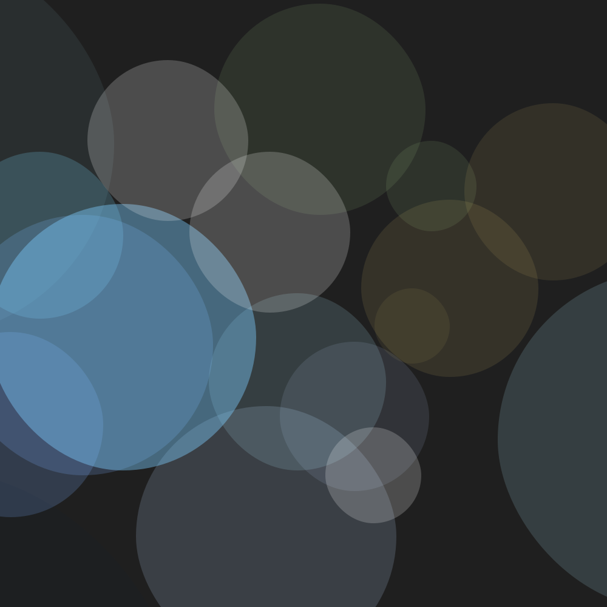

# Bokeh Ver.

###### 2025/12/25

## 简介
~~经过了一年的摸鱼最终决定~~ 以[散景](https://en.wikipedia.org/wiki/Bokeh)（Bokeh）为主题。

上一版头像也已经用了一年了，是时候换一个了。虽然上一个确实看起来还算很顺眼~~

## 设计

上次的 [Misty Ver.](./misty_ver.md) 把工程从 PowerPoint 迁移到了 PS。但是 PS 对于这种场景还是不够好用。

因为最近一直有在做表盘，接触到 Figma 这类设计工具，这次就决定再把工程迁移到 Figma。

决定换掉字体。原先用的字体 [Raglan Punch](https://fontworks.co.jp/fontsearch/raglanpunchstd-ub/) 其实是付费的。考虑到要保留粗体的特点，新字体选择了 [Roboto Flex](https://fonts.google.com/specimen/Roboto+Flex) 的可变特性来做到粗体。

最后再加个斜切，微调锚点，就能做到跟原来差不多的样子了。

---

散景其实是最先做的效果。

之后尝试调了很久颜色。后来发现，费好大劲调的颜色还不如去随便找一个好看呢。。。。

---

### 以防你忘了文字什么样：

文字描边是先把背景提亮后再来一层 100% 白叠加做出来的。只叠加太单调，只提亮没辨识度，把他俩结合起来效果就很不错～(∠·ω< )⌒★

而且描边里也能看到光圈的边缘。

还用 Beautiful Shadows 插件做了柔和的斜向阴影。

---

接近完工的时候测试了一下，发现左下角颜色有点过于亮了，跟文字描边不太能分得清，就调了下背景光圈的位置。

## 背景板

这次为了适配不同场景，做了不同比例的。

跟以往的背景也不同，这次用的是 DIN 字体。~~说不定这就是新的标准了呢~~

## 变体
### SpaceStation 74th 群头像

同样用 Figma 重置了一遍。不过模板倒是没变，我觉得现在这个够好了，不用变）