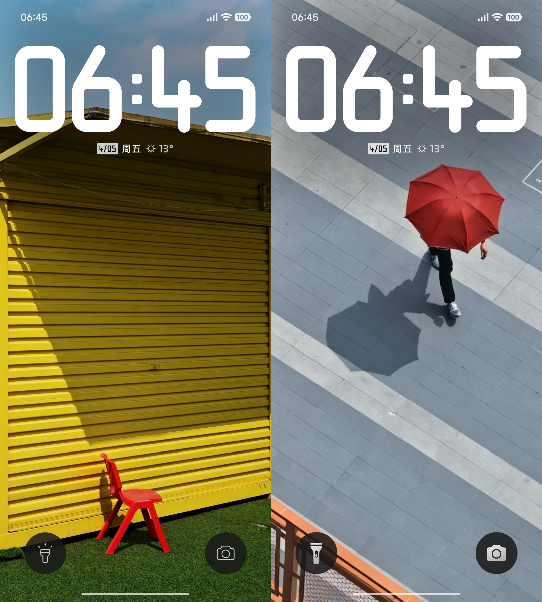
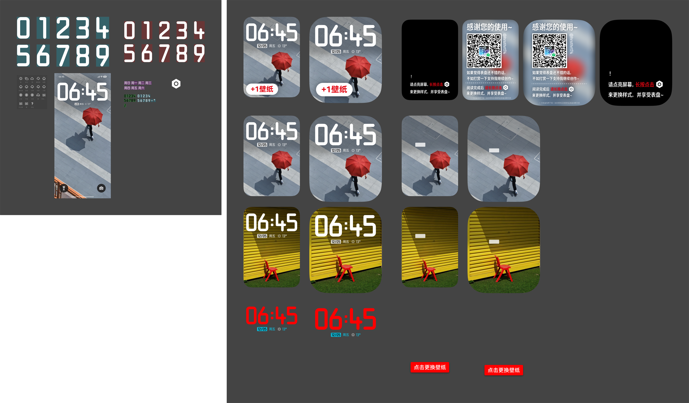
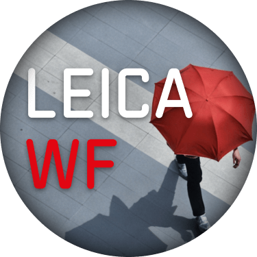
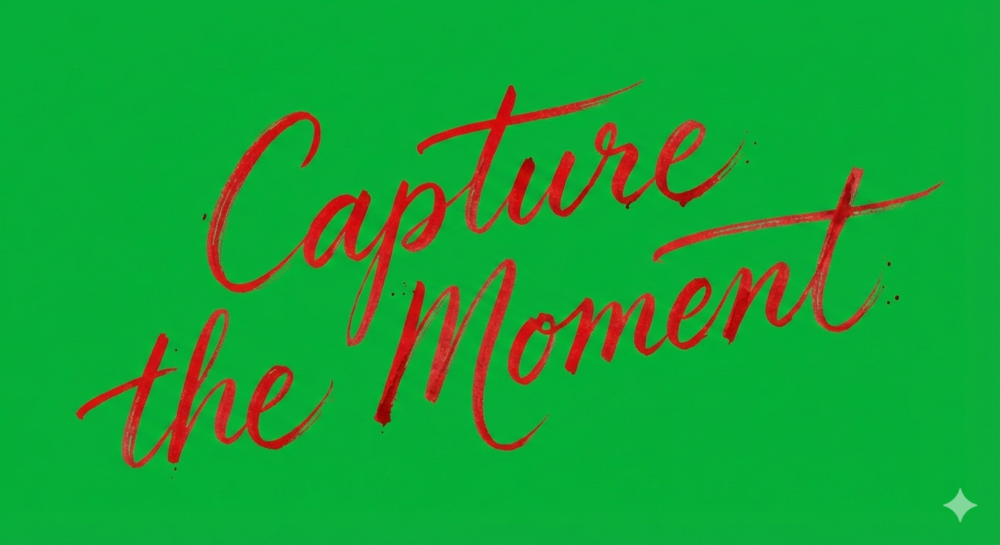

---
next:
  text: 'MaterialFlex & MaterialMania'
  link: 'docs/creation/watchface/material'
---

# CAPTURE THE MOMENT

##### 11th Watchface / 2026/1/1

觉得 Xiaomi 17 Ultra by Leica 的主题时间设计不错于是做了移植。

::: ai
*Powered by ChatGPT*

这篇文章介绍了作者制作的第 11 个表盘 **「CAPTURE THE MOMENT」**。设计灵感来自 **Xiaomi 17 Ultra by Leica 官方主题的时间样式**，作者将其移植到手表表盘上，并适配到 **小米手环 9 Pro 和 REDMI Watch**，整体基本保持原设计，只对背景亮度和布局做了适配优化。

文章重点还介绍了表盘的 **宣传图设计思路**，包括使用 **DIN 风格中文字体、相机变焦环刻度、徕卡风格元素、透视堆叠效果以及 AI 生成的手写体** 等设计尝试，并首次使用 **动态预览图**。

最后作者提到该表盘 **人气不高但评价不错**，同时它也是 **首个适配 AstroBox V2 资源格式的表盘资源**。

:::

## 原主题预览

来自 Xiaomi 17 Ultra by Leica 官方主题。

## 总览

因为是还原官方设计，基本上没有做太多的改变，就是单纯适配了一下手环而已。

官方主题解包之后，**素材都在里面了**，移植起来那是相当简单啊～～（雾）

---

值得注意的是，原主题的时间的宽度是**几乎撑满**的，在表盘上也还原了这个特点。

底图则是直接使用了来自「徕卡经典」「徕卡简约」的壁纸。做了一点点**压暗**，为了可读性。

::: info 为什么没做跳转？

考虑到又是一个人气不高的表盘，再一个是我觉得「**既然要做跳转，就要顺便把整套自定义跳转做出来**」，所以放弃了。

（发布了3个月确实没有人找我加。）

:::

## 支持设备
只做了，也只打算适配
**【小米手环 9 Pro】【REDMI Watch】**
。因为我觉得只有方屏完美适配这个时钟的设计🤨

~~圆屏我都没做（）~~

## 图标

因为标题「**CAPTURE THE MOMENT**」实在太长，Icon 上就没写这个，写的是「**LEICA** **WF**」。

**WF**
用红色跟 **LEICA** 区分。

## 介绍图
到这里才是重点😉因为用了一些
**新的**
设计元素～

当时正好发现了「[寒蝉德黑体](https://github.com/Warren2060/ChillDIN-ChillDINGothic)」这款 DIN 风格的中文字体，很喜欢，于是就在本次的介绍图里大量的使用了～

::: details 总览

:::

---

### 首图 / 封面 / 图 1

说实话不知道该怎么设计了🥲就用了经典的**渐变模糊 + 渐变蒙版**

特意没做圆角处理，主要是想表现出「**照片**」的感觉，配合一下「**徕卡风格表盘**」的意象（）

### 图 2

先从底栏讲起。

做了一个类小米的「**徕卡水印**」风格底栏，外加细红线。

然后是本次表盘做了一个透视堆叠的效果。

这么想是因为，既然打算用小米 17U 的「**徕卡一瞬**」的名字，于是就想到以这种方式去表现「**一瞬**」的感觉。

::: info 其实当时脑子里想的参考，还有一个

是 [Pixel Screenshot](https://play.google.com/store/apps/details?id=com.google.android.apps.pixel.agent) 的图标。

</img>

当年它发布的时候，感觉这个图标设计很有意思，印象很深。这不就用上了～

:::

### 图 3

因为其实能介绍的特点不多，就直接快进到定制说明了。

底下做了个类**变焦环**的**刻度线**设计。

中心线条粗且间距大，两边线条细且间距小，模拟了一下俯视圆环侧面的效果。

---

（其实照片都是我自己实拍的～）

### 图 4

又是经典的**注意事项 + QQ 群**环节，这次做了一个**路标型**的设计。

其实是因为做的时候刚好想到了
Minecraft Mod 
**Supplementaries** 的路标结构而已。

::: details 原设计参考

来自 Supplementaries 的[画廊](https://modrinth.com/mod/supplementaries/gallery)。作者为 [MehVahdJukaar](https://modrinth.com/user/MehVahdJukaar)。此处仅为辅助说明目的引用。

:::

另外叠了一层渐变，为了让背景形状看起来不那么单调，顺便搞一点点金属的感觉。

### 图 5

你知道吗？
其实这里的手写体是 AI 生成的。

老早就知道 AI 辅助设计了，这次正好想到了**在几何感强的黑体里插入高亮色的手写体**的设计，就让 AI 帮我生成了手写体插进去。

最终效果我自认为还是不错的。

::: details 关于 AI 图

生成了好几次才有看起来还不错的效果。当时还把 Nano Banana 的每日额度用光了😂

:::

顺便这次给表盘搞了**动态预览图**，于是引导了下用户「继续滑动 浏览动态预览图」

虽然那个动态预览图没啥信息量啦，这又不是动态表盘 \_(:з」∠)\_ 

不过既然 AstroBox 能放 Animated WebP 预览图，那就用呗～之前我还没用过动态的预览图（）

## 后日谈
如预计般人气不高😇😇但是好在仅有的几条评论还都是好评的

关于定制呢，也是能预见得到的，没人找（）那就算了

## 你知道吗？
- 这应该是 **第一个** 适配了 AstroBox V2 资源格式的资源。

  当时发布的时候赶上 V2 格式出炉，就立马更新了一个出来～

  *由于当前 AstroBox V2 还在内测，各位感兴趣的话，得等到 V2 正式上线才能看到新特性的效果～

## 感谢你看到这里！
不妨去 AstroBox 下载体验一下😋

<WFDownloadBtn title="CAPTURE THE MOMENT" resourceName="CAPTURE THE MOMENT" />

## 评论

<Giscus />