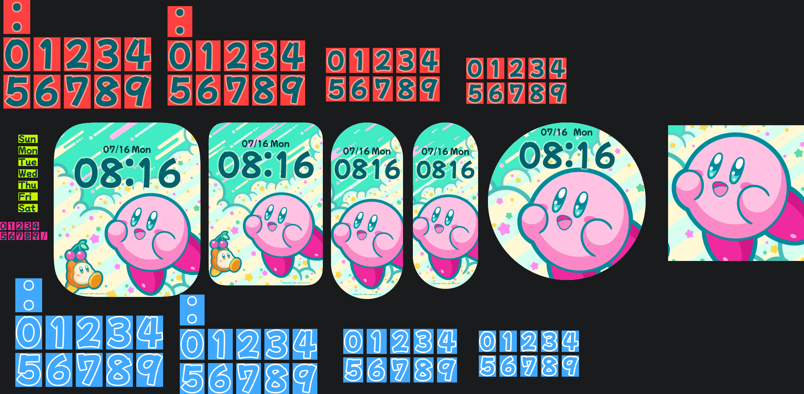
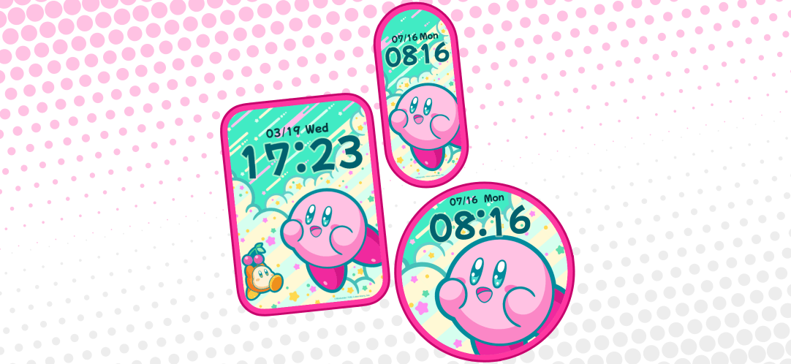

---
prev:
  text: 'authRD'
  link: 'docs/creation/watchface/authRD'
next:
  text: 'The Commander'
  link: 'docs/creation/watchface/The_Commander'
---

# PoP☆P

###### 2025/7/25
为了 AstroBox 上架 ~~去抢一波流量~~ 而做的表盘。也是我的第一款多设备表盘。

::: ai
### 核心亮点
- **主题创意**：受任天堂《星之卡比 新星同盟》启发，采用半调设计风格和可爱元素，搭配生日限定壁纸资源。
- **多设备适配**：首次支持多款小米手环设备，扩大用户覆盖面以提升流量。
- **字体选择**：时间显示使用 HyperOS 2 锁屏预设字体 **Mochiy Pop One**，中文标题采用筑紫A丸Gothic。
- **宣传策略**：为 AstroBox 平台设计，采用纯图片宣传图提高吸引力。

---

### 设计细节
1. **视觉风格**  
   - 背景模仿游戏半调特效（参考 Whispy Woods 场景）
   - 标题文字复刻《新星同盟》Logo 样式
   - 主视觉使用卡比官方素材增强辨识度

2. **交互彩蛋**  
   - 日期区域隐藏跳转功能（未宣传因触发区域难操作）

3. **效率优化**  
   - 素材分类管理提升开发效率

---

### 成果反馈
- **平台推荐**：获 AstroBox 开发组认可，登上首页 Banner 推荐位
- **用户反响**：在平台反馈区高频出现，下载量可观（但平台无统计功能）
- **流量达成**：成功实现"抢流量"目标，弥补此前在米坛的遗憾

---

**总结**：一款以流量策略驱动、融合任天堂IP元素的卡比风多设备表盘，通过精准的平台定位和视觉还原度实现传播目标，获官方推荐验证设计质量。
:::

## 动机
上一世因我懒没在米坛/自定义工具吃到流量😱

这一世我要把我的流量抢回来😡

---

......其实还因为我去看了下八百年没看的 Gmail 收件箱，发现过生日的时候**任天堂发了邮件**，里面有[生日限定壁纸](https://www.nintendo.com/jp/wallpaper/24_HBD_A/index.html?utm_source=conditional&utm_medium=email&utm_campaign=2024_birthday&utm_content=html&utm_term=na)。

为了 ~~流量~~ 人气，就要挑一个大众一些的题材。正好卡比的**可爱风**就适合做表盘。

正正好好任天堂还 ~~贴心地~~ 提供了**不同的比例**，刚好适合适配**多设备**。

也正好赶上高考后的暑假，有时间了，这不开搞？（（（

## 设计

时间的字体没用游戏内的字体，而是用了 [Mochiy Pop One](https://fonts.google.com/specimen/Mochiy+Pop+One)，HyperOS 2 的锁屏预设字体之一。这个属于是**一拍脑门想出来的**（）不过好在实际效果还是不错的。

布局没什么好说的。**高情商**：熟悉的设计，快速上手；**低情商**：垃圾换图表盘。

为什么要做多设备适配呢？也是考虑到**抢流量**。支持的设备越多当然流量越大拉~（）

## 宣传图
::: details 图片

:::

从这个表盘开始，上架米坛也会用纯图片了。

---

背景主题采用了[半调](https://zh.wikipedia.org/zh-sg/%E5%8D%8A%E8%89%B2%E8%AA%BF)的设计风格。这个是在模仿[《星之卡比 新星同盟》](https://wikirby.com/wiki/Kirby_Star_Allies)的设计风格。

::: details 参考图

引用自 [Wikirby](https://wikirby.com/wiki/Kirby_Wiki)。

:::

---

标题文字也是仿的新星同盟的标题样式。中文部分为了图省事，用的是**筑紫 A 丸 Gothic**，也是**带一点可爱的**字体。
::: details 参考图

引用自 [Wikirby](https://wikirby.com/wiki/Kirby_Wiki)。

:::

---

最后一张图用的还是用了新星同盟的资产（（（（（

::: details 参考图

引用自 [Wikirby](https://wikirby.com/wiki/Kirby_Wiki)。
:::

## Banner

一口气上传了**五个**资源到 AstroBox，结果真的得到了**开发组的注意**（）

::: tip 开发组说：
“你的资源质量很高，这边打算给你一个首页banner”
:::

有点**受宠若惊**的感觉...不过**我的目的**也确实**达到了**~

::: details 看起来是这样的：

:::

## 后日谈
据我观察，反响确实**很不错**，**经常**能在 AstroBox 的反馈里看到有人下载我的这个表盘~~

（不过 AstroBox 资源存放的方式决定了他做不了下载量统计，导致看不到具体下载数，还是有点可惜的~）

## 你知道吗？
- 标题的全称是「**Pop Star Parade**」。为了简短和有特点，简写成了「**PoP☆P**」。
- 日期部分做了跳转，但是懒得做触发区域了，导致很难点。于是就没宣传这个特性，也没删掉这个特性。
- 素材文件夹做了简单的分类，提高了效率。

## 感谢你看到这里！
不妨去 AstroBox 下载体验一下😋

<WFDownloadBtn title="PoP☆P" resourceName="PoP☆P" />

## 评论

<Giscus />