---
next:
  text: 'banDS'
  link: 'docs/creation/watchface/banDS'
---

# WF2

##### 8th Watchface / 2025/8/16
「变成『2』，~~一切都是新的~~。」

<Color color="var(--vp-c-text-2)">* 本句出自 Nintendo Switch 2 的宣传语。</Color>

::: details DeepSeek 总结
:::

## 灵感
还是还是**在学校**想到的？~~是的兄弟~~

觉得 NS2（NS1）的 UI 很简洁于是做了表盘。

虽然快高考了，但还是一直有在关心 NS2。

虽然 NS2 的 HOME 菜单跟 NS1 **没什么区别**，不过 NS1 时代我就挺喜欢这个简洁的 UI，这次正值 NS2 发售，干脆来做 **NS2 风格**的好了。

## 开工
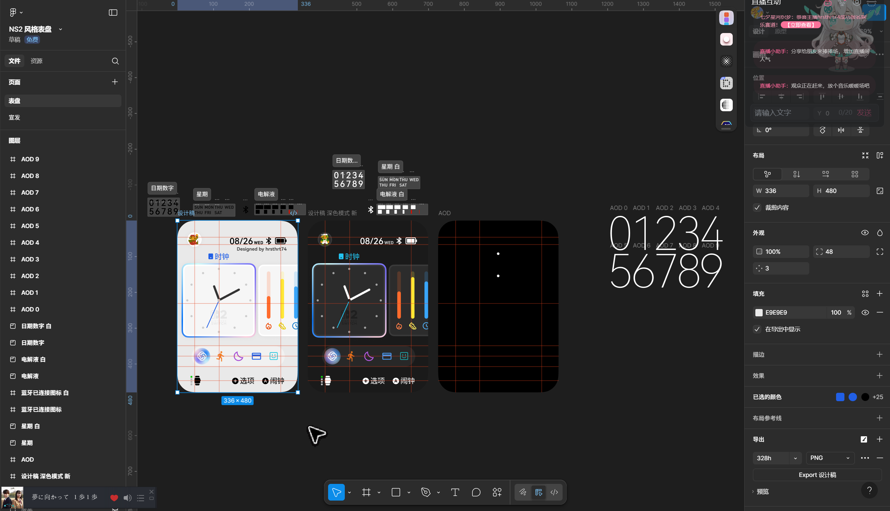

---

NS2 的 UI 虽然大体上延续了 NS1 的设计风格，但细节上**变化却很大**。

::: info 小小的评价
网上很多人都觉得 NS2 这个跑马灯选框看起来很“丑”“杀马特”。不过我觉得其实并没有那么难看。

感觉渐变选框其实看起来**更有活力了**🧐
:::

---

布局任天堂已经**设计好了**，接下来就要想怎么把这样的设计做到手环的**小屏幕**上。

观看方向上，大多数情况下，NS2 是**横屏**的，手环是**竖屏**。

<Highlight>NS2 可以把软件一口气地**横向排列**在屏幕上，可是手环呢？</Highlight>

为了让元素不至于小到**看不清**，就只能放下 1.5 个图标了。

::: info 为什么还有个 .5？
一是原设计就是这样的。

二是为了保证**整体协调**。

如果只显示一个软件图标，看起来就不像是**游戏机的 UI**（现代游戏机哪有桌面只显示一个游戏的）；

如果显示两个完整的软件图标，单个软件图标就看起来**太小**。
:::

这次还做了**可切换的深浅模式**，~~原因是有一天半夜自己测试表盘的时候被亮瞎了~~

接下来开始一介绍表盘的各个元素。

## 状态栏
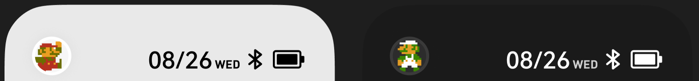

### 头像
一直没决定放什么图好。毕竟这东西还是太**个性化**了...

有想过 [Mii](https://en.wikipedia.org/wiki/Mii)。但是头像的实际显示面积实在是太小，Mii 放上去的话看起来**糊得要命**，于是就放弃了。

后来想到，既然要做深浅色切换，是两种样式，不如把马力欧**马叔**放上去吧，深色就把**老路**放上去。

FC 的马叔，即使**显示面积小**观感也不会太差。

::: info 实际上...
放大了一倍。倍数真的如我所想那样不高。
:::

### 日期
用的是 [HarmonyOS Sans](https://developer.huawei.com/consumer/cn/design/resource-V1/)。

原版我目测是个类 **DIN** 的字体。不过经查貌似不是，数字 7 没有**衬线**。

网上下载了几个类 DIN 字体，效果都不太彳亍，自己画也懒得画。

经过了 ~~几秒钟的思考~~，于是就决定是 **HarmonyOS Sans** 了。

::: info 为什么不是 MiSans？
两个字体比起来，我觉得在数字上还是 HarmonyOS Sans **更有设计感**。

4 的开口看起来也很有 **DIN** 内味。
:::

星期是 **80% 不透明度**的，不过在这么小的显示面积上，不**细看**基本看不出来。

### 状态图标
原版会显示**网络连接**状态，这里就改成了**蓝牙**的连接状态。未连接时会**变灰**。

电池最开始是打算用 **Fluent Design** 的电池图标，不过发现缩小了之后不能做到点对点，就**自己画了个**电池，~~这个不难（）~~

电池图组的名称一样还是叫“**电解液**”。

::: info 百分比？
NS **可选**是否显示百分比。

我没这么做的原因，一是做了之后状态栏会跟后台应用图标/通知小红点**重叠**；~~二是我懒~~
:::

---

状态栏最开始没有现在这么大。不过群友建议可以改大一点，我改大了之后初看还不适应，但是看久了确实是要比初稿看起来**更舒服**。在此感谢群u  (∠・ω< )⌒☆

## 软件图标
↑ 应该是任天堂官方的叫法（未查证）

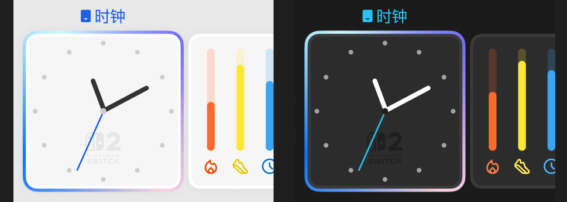

### 时钟
顶上的**已插入卡带图标**，有想过要不要换。后来觉得留着也挺有意思的，好像实体版的闹钟 （~~不是阿拉莫~~）那样，那还是留着吧~~

::: info 你任除了 Alarmo 真的出过可玩的闹钟
比如 DSi Ware 的照片闹钟。

<Color color="var(--vp-c-text-2)">虽然不是实体版，也没多少“游戏性”拉~但想到了还是提一嘴。</Color>

这个是我的 NDSi 上前机主购买的软件之一。在我还没有重度使用手机的童年，我真的有用这个在定闹钟，印象挺深的。

::: details 后来...
买了 3DS（老小三）之后把这个**正版**软件搬家到 3DS 上了。结果发现画面会缩放，本来 NDS 的分辨率就低，3DS 上一缩放更是**糊得要命**。

用点对点模式的话，画面会**非常小**。

所以挺后悔迁移的。迁移后的效果**还不如原机呢**...
:::

用模拟时钟，一是有受到[上一个表盘 banDS](../watchface/banDS.md)（NDS 风格）的影响，二是总做数字时钟想尝试**另一种风格**。

本来想做**可更换**时钟底板的（就像游戏封面那样），不过因为**工作量大**放弃了。

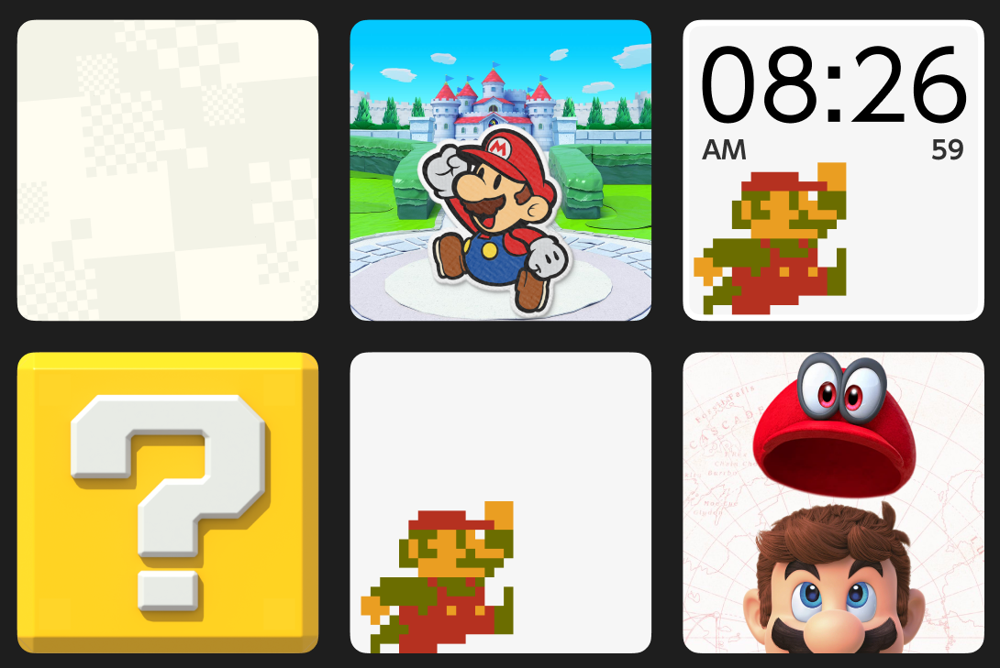

---

三针用的是比较简洁的设计，跟 NS2 UI 的简洁风格对应。

底下还加了个 NS2 的 Logo，算是一时的灵感，看起来**效果不错**就留下来了。

Logo 的颜色则特意**压暗了**，尽量让它成为**装饰**，不要干扰时间的**可读性**。

### 活力数据

↑ 以防你忘了上面的图

一开始是想像 3DS 上的 [思いてきろく帳](https://www.nintendo.co.jp/hardware/3dsseries/activitylog/index.html) 那样的风格设计的，但是发现其实并不适合 NS2 的**简洁风格**，即使是**拍扁了**变成扁平化的风格，也觉得**怪怪的**。

<Highlight>于是就回归了**经典的**进度条样式。</Highlight>

...

<Color color="var(--vp-c-text-2)">这次不是懒啊（）伪 3D 的进度条做起来也不难的，没做只是觉得不合适而已。</Color>

---

第三个条被裁掉一点点，**这个是故意的**（）

图标在深色和浅色下的颜色不太一样，是为了**适应深浅模式**。

## Dock 栏
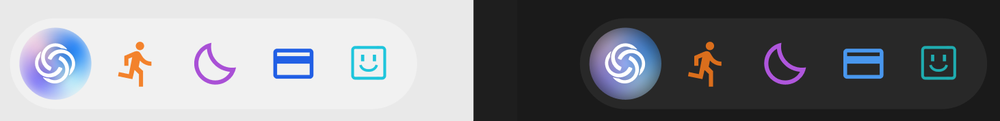
看起来还挺有 NS2 内味的。

### 小爱同学
放这个是为了跟 Nintendo Switch Online 的图标对应上，<Highlight>于是用了有颜色的背景。</Highlight>

从一开始就打算用的是选框的**四色渐变**做背景，做好后才反应过来——跟超级小爱的主题色**也挺像嘛~**

::: details [长图] 超级小爱的截图
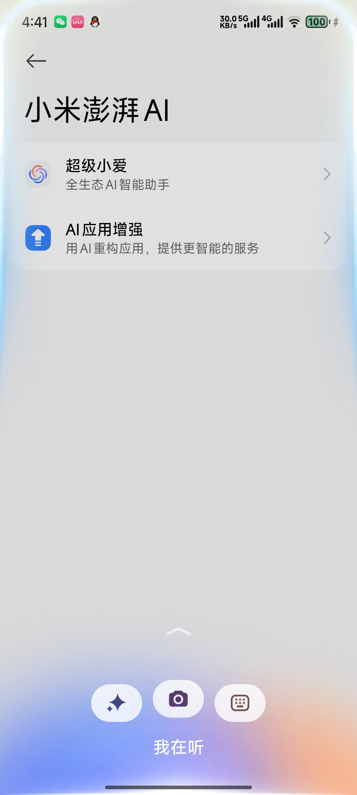
:::

---

Figma 里给四色渐变上了个**图层模糊**，但是怎么也搞不好模糊半径到底应该是多少。

模糊半径**大**了，背景更**白**，可读性就会**降低**；

模糊半径**小**了，中间的“点”看起来就更**突出**，更**丑**。

...后来想到，给超级小爱的图标上个**小阴影**不就解决了高半径下的可读性问题了。<Color color="var(--vp-c-text-2)">就，有点子难绷。</Color>

::: info 小小小细节
深浅模式下，模糊半径**不一样**。

浅色是 10，深色是 20。

为啥深色下半径变大了？因为半径越大<Color color="var(--vp-c-text-2)">越透背景</Color>，深色模式下透背景反而能**提高可读性**，也让这个图标没那么耀眼了。
:::

### 其他图标
想了几个能跟原机图标颜色**对应上的**，后来也根据哪些功能常用决定了放哪些图标。

特别说下压力。任豚应该都看出来了，图标就是**好友**的那个。

[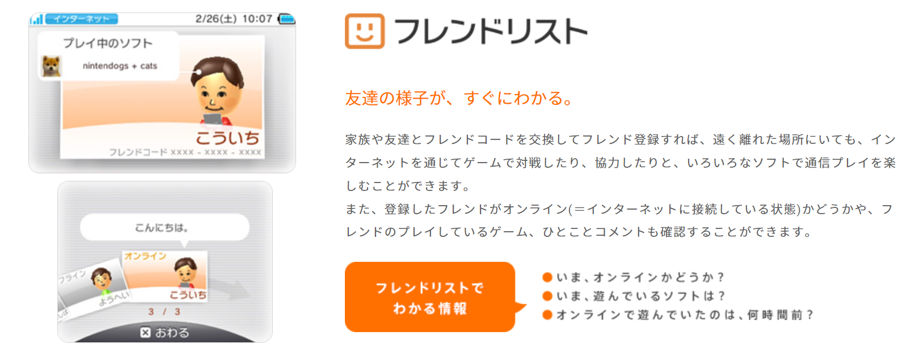](https://www.nintendo.co.jp/hardware/3dsseries/built-in/index.html)

感觉很适合当作压力的图标，于是就决定是它了。

---

图标并不是完全**均匀地**横向分布的，有一些**偏移**。

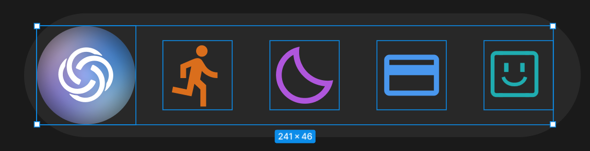

这个是根据**视觉上的平衡**来调整的。

## 按键提示
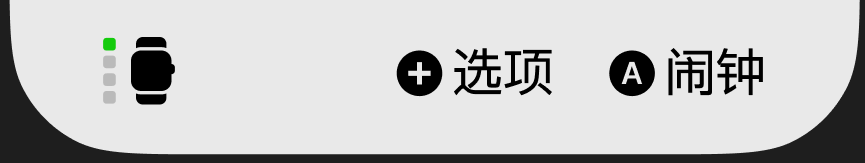

### 手柄分配提示
这里其实**没有**绑定数据，就是**纯装饰**，我没想好要绑定什么数据（）。

电量？考虑过，但我还是那句话，都有**更大的**了为啥还要看更小的（如果大的那个没问题的话）

图标用的是 Fluent Design 的图标。

### 按键
**能点**。

NS 也是这样的。

不同的地方是，A 键的提示是“闹钟”，不是“启动”“开始”“时钟”。<Color color="var(--vp-c-text-2)">一个小细节（）</Color>

## AOD
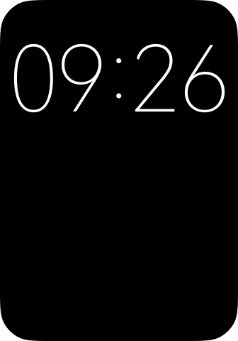

没活了。

没用亮屏同样的样式，跟[上个表盘的原因](../watchface/banDS#aod)是一样的。

## 命名
简 单 粗 暴。NS2 -> W<Color color="var(--vp-c-text-3)">atch</Color>F<Color color="var(--vp-c-text-3)">ace</Color>2。

## 图标

简 单 粗 暴。就是把 NS2 Logo 里的 Joy-Con 换成了手环。

## 介绍图
::: details 总览

:::

整体上参考了 NS2 的卡带包装盒和 eShop 上 NS2 游戏的**横幅样式**。

虽然这个红色大额头设计丑得跟 New 3DS Only 的卡带包装**有过之而不不及**，但为了**还原**设计，只好这么干了（）

### 首图 / 封面 / 图 1

第一次把渲染图放在首位。想了想可能是因为我觉得 NS2 的渲染图 / 视频**很有质感**吧，于是也这么做了。

~~毕竟 NS2 的首曝视频和介绍视频我可是各自都看过不下 20 遍的（（（（（~~

---

“Nintendo Switch 2 <Color color="var(--vp-c-text-2)">风格表盘</Color>”这一行特意把“风格表盘”弱化了。

因为以前的图里有过“风格表盘”比原作标题**还要大**的情况，然而大家显然是**更想看到原作标题**的是吧（

---

右边稍微引导了一下用户继续滑动。

### 图 2

延续了**大红条**，还加了**页数显示**。

“完美还原 Switch 2”这个大字+细体+四色渐变外发光的设计，其实是跟 NEORUAA 佬的视频封面里学来的。

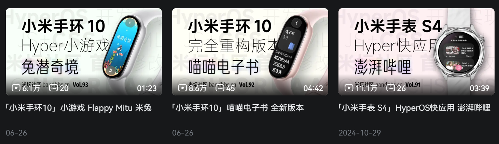

### 图 3

平平无奇了。

### 图 4

这次的不同点就是，把交流群的部分做成了个**消息气泡**的样式。

### 图 5

这次没有大字了，取而代之的是对话框样式包裹的文字。

背景用了渐变 / 渐进模糊。特意调了锚点，让进度条看起来跟**化开了**一样（（（（

## 跑道屏？
目前不打算适配。

NS2 的 UI 本身就是**针对横屏**设计的，在手环 Pro 的**竖向屏幕**上能还原我觉得已经不容易了，

想要移植到细长的跑道屏的话，我能力还是不够，**设不出来啊**~~抱歉了。

所以 WF2 是**专为**手环 Pro 的方屏适配的。对于其他方屏 / 圆屏的设备，因为用户太少**不打算适配**了。

~~不过打钱的话也不是不行~~

## 后日谈
看起来人气比我所想的**要高啊**~

倒也不是在**自卖自夸**，我这么说一是有人搞**非官方移植**；

二是在表盘自定义工具上，WF2 下载量比同期上传的 authRD(×2) + banDS 三款加起来**还要高**。

WF2 设计上算是**实验性质的**表盘，我是没指望有多少下载的（）

<Highlight>在此感谢各位 🙇</Highlight>

---

也有人搞跑道屏的移植。

[前文](#跑道屏)已经提到了因为是专为手环 Pro 的方屏打造的，所以我不会适配。

不过群里的 Qq 也已经花了时间精力把表盘**做好了**，我也不好意思说“不能发布”让人家的**时间精力白费**，就同意了。

::: tip 但是有以下的条件
- 原作者 hrsthrt74

- 本版本为非官方移植版

- 移植版不代表原作者设计
:::

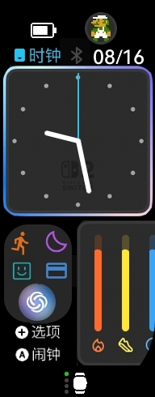

## 你知道吗？
- 这次同样用了纸来**打草稿**。不过写的没上次多。
  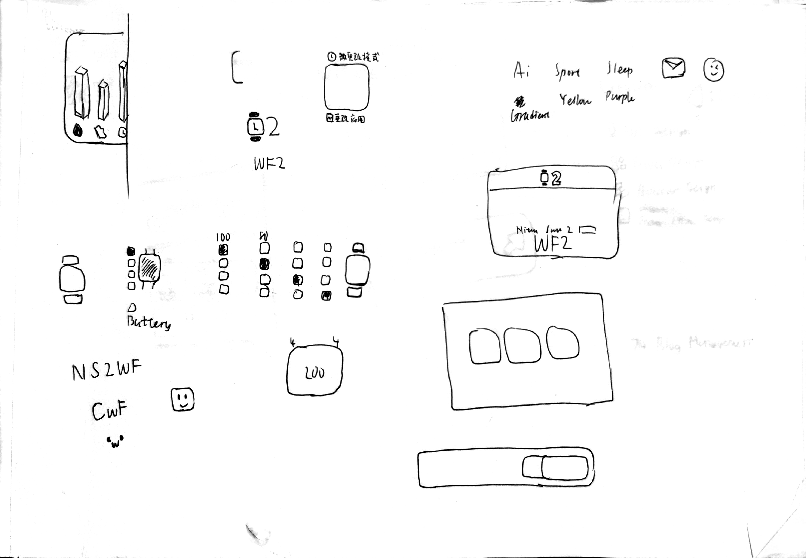

- 本来想给那个选框做**动态效果**的，但是因为不会用 AE 来实现，只好作罢。

## 感谢你看到这里！
不妨去 AstroBox 下载体验一下😋

<WFDownloadBtn title="WF2" resourceName="WF2" />

## 评论

<Giscus />