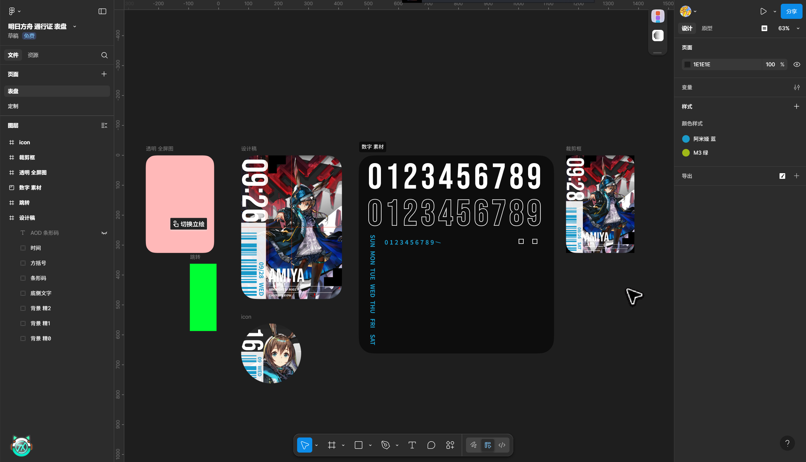
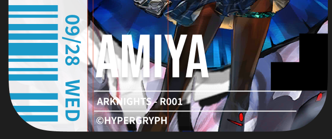
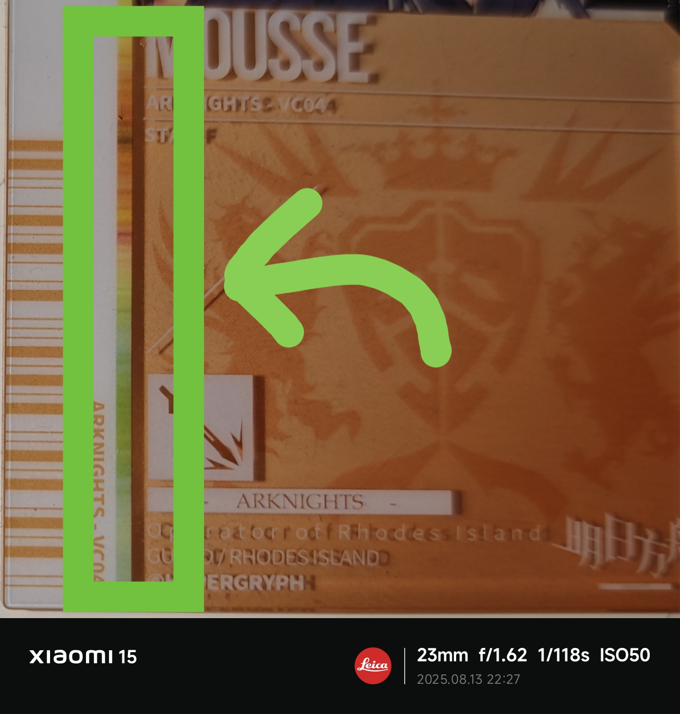
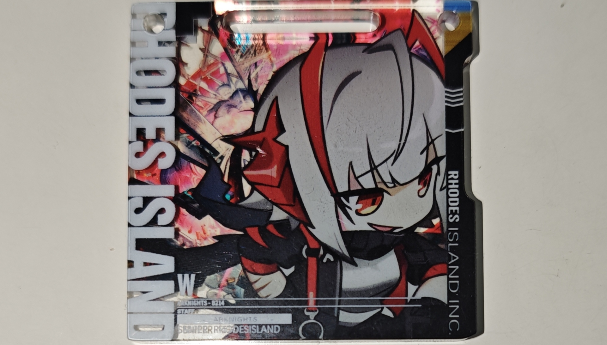
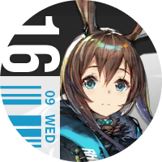
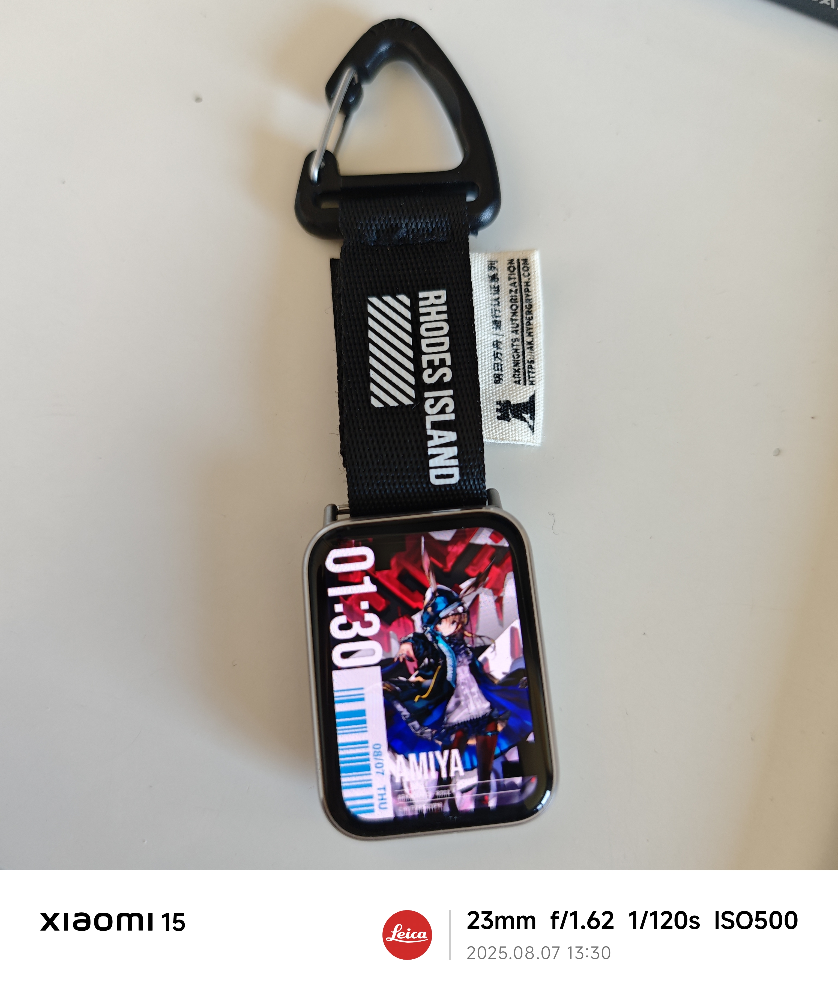

---
prev:
  text: 'banDS'
  link: 'docs/creation/watchface/banDS'

next:
  text: 'PoP☆P'
  link: 'docs/creation/watchface/Pop_star_P'
---

# authRD

##### 6th Watchface / 2025/8/9
时隔 9 个月的大饼，终于给圆上了 (∠・ω< )⌒☆

::: details DeepSeek 总结
### **设计主题**  
**「authRD」** - 灵感源自《明日方舟》的罗德岛通行证，将游戏元素移植到小米手环表盘，打造「腕上赛博通行证」。

---

### **设计历程**
1. **灵感起源（9个月前）**  
   - 上课摸鱼时绘制高完成度草图，受实物版「MC通行证」启发（见原文草稿图）。
   - 初期预览效果不佳（左侧数字栏显杂乱），项目搁置。

2. **重启设计（2025年8月）**  
   - 大幅修改原稿：**舍弃数字栏**，替换为通行证同款**条形码区域**（内容为 "amiya!"）。
   - 背景采用《明日方舟》干员培养界面素材。

3. **关键设计决策**  
   - **时间显示**：避开屏幕圆角裁切（如数字0/2贴边问题），添加阴影提升可读性；右移适应AOD描边。
   - **条形码**：Google Fonts字体 + 90%白透明背景（模拟实物透光感），宽度窄于时间区域以突出时间。
   - **元素取舍**：  
     ✓ 保留：干员代号、编号、版权标识、边角「舟味装饰」  
     ✗ 舍弃：右侧黑条、职业图标、多余文字（空间不足时显累赘）  
   - **AOD优化**：添加条形码平衡左侧留白。

4. **命名与图标**  
   - **authRD** = "authorization" + "RhoDes"（RD取自拼音「罗德」首字母，增强联想）。  
   - **图标**：融合时间/条形码/立绘三大核心元素（见原文icon图）。

---

### **特色与彩蛋**    
- **赛博玩法**：实物通行证+手环组合（图一乐，风险提示：易磕碰/丢失）。  
- **趣味冷知识**：  
  - 曾计划仿《终末地》设计Logo/宣传视频，因懒放弃（笑）。  
  - 时间竖排设计实际体验无障碍。  

---

### **设计理念**  
- **还原与适配平衡**：保留通行证灵魂元素（如边角装饰、条形码），同时为小屏精简内容。  
- **细节强迫症**：条形码宽度/背景透明度等微调，均以实物观感为参考。  
- **用户反馈**：创意获好评（"腕上通行证"概念新颖）。  

---

> **总结**：一次从「摸鱼草图」到「赛博通行证」的9个月圆梦之旅，在还原游戏情怀与手环实用性间找到平衡，细节控的胜利 ✨  
> **文末吐槽**：懒是生产力最大敌人（视频/Logo计划全鸽）→ 但成品真香！(∠・ω< )⌒☆
:::

## 画大饼
9 个月前……

与 [The Commander](../../../docs/creation/watchface/The_Commander.md) 如出一辙，也是**上课摸鱼的时候**想到的设计。~~可惜草稿找不到了~~

不过这张图的完成度比 The Commander 的草图的**完成度更高**。当时正好有在搞**实物的自定义通行证**，因为摸不到电脑就在纸上很认真地画了。authRD 的草图也是“**托了它的福**”，画的比较认真。

::: details 挺详细的 MC 通行证草稿

**字丑**。另外别问为什么写的字全是英文，问就是在学校的**奇怪的习惯**，防别人看懂用的（（（）

也不要在意我写的英文**是不是对的**（（（（（（

下面是实物图：

:::

---

在这之后，24 年年末的时候搞了个图**预览**。

::: details 图

不过效果一般。左边栏看起来还是**有点乱**。
:::

在这之后就一直在摸鱼了。~~一时摸鱼一时爽，一直摸鱼一直爽~~

## 开工
再想到这个项目已经是 9 个月后了。在这之间搞了 5 个表盘，因为嫌麻烦一直都没有再把这个项目捡起来。

旅游后回来想做点什么，但又不知道做些什么......于是就又想起来了这个项目。**那就开工**！

这次开工和 The Commander 一样，跟原稿都有**较大的出入**。当时想到原设计左边一列全是数字**看着乱**，这次就把下半部分改成了与通行证原设计相同的**条形码区域**。

## 主元素设计

### 背景
原版通行证可以是透明的。可是表盘咋透明呢 😂 也不能放个大黑底上去吧，**丑到没边了**

于是用了方舟的干员培养界面的背景。

::: details 图

引用自 PRTS.wiki。版权属于鹰角网络 / 明日方舟。
:::

实际观感我自认为是不错的。

### 时间
原版的 RHODES ISLAND 文字是紧贴边的。然而在表盘上，因为有 48px 的圆角，并不能让数字也贴边，贴边的话观感会**很差**——如果第一位数字是 1 那还好，可是 0 和 2 呢？

::: details 异变哒

:::

答案显而易见了。于是数字下放了一些。这样的话，显示 0 和 2 时的裁切就达到了**可以忽略的程度**。PASS ✓

---

不仅如此，时间还**向右移了**几 px。这个则是为了 AOD。我的表盘的 AOD 比较喜欢给文字做**外描边**，如果文字太靠左的话，描边最底下一层就可能会**被裁掉**。不好看。

此外文字还做了一点点阴影效果，为了**可读性**。

### 条形码
用的是 Google Fonts 里的一个条形码字体。内容是「amiya!」。

虽然知道方舟通行证的条形码不是瞎打的，是**有意义的**，不过**因为我懒**就没去找原字体，Google Fonts 里随便挑了一个字体就放上去了。（（（）

条形码旁边的文字，原版是干员代号。表盘这里则是放的日期。这个是考虑到右侧已经有了干员代号，且**日期缺个地方放**……嗯，那就这里吧。

---

背景用的是 90% 白。这里试过了模糊、渐进模糊、液态玻璃，感觉都很怪。最后选了朴实无华的一点点透明的白。

::: info 为什么不选 100% 白？
这个是考虑到，方舟的通行证的条形码背景，虽然印刷时源文件可能是 100% 白，但由于**白墨也会透一点点光**，实际观感**并不是完全不透光的白**。于是表盘便用了 90% 白来模拟这种观感。

也在不失可读性的前提下让背景**更好看了一点点**。
:::

此外仔细观察，条形码的背景实际上比时间**更窄**。由于条形码是实心填充，时间是空心的，所以条形码适当收窄一些我觉得可以**衬托时间**，默默地又提高了一点点时间的可读性。

---

AOD 本来是不打算加条形码的，但是感觉**左边太空了**，还是加上了。

---

::: details 好像还缺点什么？
嗯，原设计 ~~意义不明~~ 的彩条我没加。我觉得加上的话，在手环上看起来就有点太乱了……

:::

## 把大象装进冰箱里
原版通行证的元素很多，然而放到小米手环这样小的屏幕就需要简化、舍弃元素。还原可以，但这绝对不是完全还原，还要考虑到实际观感。

### 基础信息
手环屏幕就这么大点，于是简化了内容。只留了最重要的信息——干员代号、编号、版权标识。

::: info 版权标识……
这里我觉得还是留着好一些。毕竟原设计就有……
:::

也有参考我手上买过的一个迷你通行证。

这个是 5cm*5cm 的，也需要简化元素。于是拿它做了参考。

### 边角「 」
**舟味的灵魂之一啊**，**怎么可能不加**（滑稽）。

不过在选用的三个阿米娅立绘里，这个边角**并不是很显眼**。同时也因为电子屏幕**发光均匀**，没有了亚克力那种**立绘透光**，**边角不透光**的感觉……

**不过通行证不能没有边角装饰**，**就像西方不能没有耶路撒冷** 🤓☝️

### OUT 掉的元素
原设计右边的黑条和异形设计被**舍弃了**。本来表盘的宽度就窄，时间又占去很大部分，再加个黑条，给立绘留出的空间就少了。于是舍弃掉了。

干员职业、ARKNIGHTS 横条、OPERATOR OF RHODES ISLAND 文字也都去掉了。这些在空间足够时是**好看的点缀**，空间不够时就是**累赘**。故舍弃之。

## 命名
是在制作**相当后期时**才定下来的。工程文件夹确实就是**简单粗暴地**叫“明日方舟 通行证 表盘”。

由于我的表盘第一作直接用了**原作品名**，导致名字实在是**太长**（18+ 个字），所以必须想一个**简短**又能**体现原作特点**的名字。

拿起电脑边的 ~~byt~~ 通行证盒子，看到“RHODES ISLAND AUTHORIZATION”一行字……

::: tip 嗯那就叫：
authRD 吧！
:::

其中 RD 取的是 RhoDes Island 的 R 和 D 两个字母。

::: info 为什么不是 RI？
我觉得 RI 跟 RD 比，还是 RD **第一眼看上去**更能让人想到罗德岛。

毕竟 L(R)uó Dé 岛嘛～ RD 除了可以指**英语里**前两个音节的辅音字母，也可以是指**拼音首字母**嘛～这不比纯基于英文的 RI 好联想到罗德岛嘛（笑）。
:::

auth 和 RD 之间没有空格。一是为了**紧凑**，二是不加空格**也比较容易分辨**两个单词，于是就这样命名了。

## 图标

提取了表盘**最核心的三个元素**——时间、条形码、立绘。并很好地把他们塞进了圆里（（（

## 介绍图
::: details 图片

:::

这次的介绍图，在第二页就直接说明了表盘的**全称**「authorization of Rhodes Island」。

框框的样式模仿了方舟里的 ~~奸商可露希尔的月卡广告~~ 滚动 Banner。

其余的部分其实没有太多好讲的。有稍微试着去模仿“**舟味**”，但是**技术力不足** ~~再加上我还是懒~~ 所以看起来并没有多少舟味。

## 其他玩法？
🔥🔥🔥**赛博通行证**！！

可惜不能**常显**，真挂起来的话不仅**成本高**，**风险也高**（容易磕碰 / 被顺走），**图一乐**就得了。

## 定制

因为通行证本身就是个**模板**，所以还搞了**有偿定制**的服务。不过呢我收的只是**人工费**（）毕竟整个设计的版权都不是我的。

我只是在收要求我定制的**人工费**（）

## 后日谈
看起来这个腕上通行证**没人想到过**？看到有人觉得这个想法还**挺有创意的**，我也觉得**挺开心的** (∠・ω< )⌒☆

虽然设计不是我原创的，但是我给搬到了米环上（（（（（。

---

用了一阵子之后，看起来可读性也是没有太多问题的。原本以为竖排的时间可能看起来会费劲，实机上我自己感觉其实还好。

## 你知道吗？
- 本来还打算**做个视频**宣传下，后来因为懒，摸了。
- 本来还打算**做个 Logo** 配合宣传，想仿《**明日方舟 终末地**》的 Logo 设计，后来也是因为懒，摸了。

::: details 终末地 Logo

:::

## 感谢你看到这里！
不妨去 AstroBox 下载体验一下😋

<WFDownloadBtn title="authRD" resourceName="authRD" />

## 评论

<Giscus />