---
prev:
  text: 'WF2'
  link: 'docs/creation/watchface/WF2'

next:
  text: 'authRD'
  link: 'docs/creation/watchface/authRD'
---

# banDS

##### 7th Watchface / 2025/8/13
又是**几个月前**的想法成真~（不用滑动头图，划了也没用（（（

::: details DeepSeek 总结
### 🎮 灵感来源
- 长期钟情于原版 Nintendo DS（NDS）的 **BIOS 界面设计**，特别是其低像素图标、网格系统和硬朗线条。
- 虽个人首台设备是 NDSi（界面不同），但对原版 NDS 界面怀有特殊情感，最终决定将其复古像素风格融入小米手环表盘。
- 设计构思多来自学校“摸鱼”时刻，本次项目在高考后正式启动。

---

### 🎯 核心设计目标
1. **像素完美**：严格遵循点对点还原，追求原汁原味的 NDS 低像素风格。
2. **双网格融合**：结合上下屏不同密度的网格系统（上屏细网格、下屏粗网格），保留 NDS 布局精髓。
3. **模拟时钟**：坚持加入模拟时钟样式，致敬 NDS 传统的同时增强复古感。

---

### 🧩 设计实现亮点
- **状态栏**：保留用户名、日期、电量，精简原版元素，优化视觉平衡。
- **时钟设计**：
  - 提供数字与模拟双模式；
  - 编辑按钮结合 PictoChat 与设置图标，创意缝合。
- **日历组件**：受限于屏幕，改用长条式日历，保留周六蓝、周日红的经典配色。
- **网格系统**：历经多次迭代，自主绘制像素精准的网格，最终实现视觉无缝衔接。
- **卡带图标**：以模糊化处理模仿 NDS 游戏图标，点击跳转活力数据。
- **底栏功能**：保留 NDS 设置、手电筒、闹钟三大功能，图标设计兼顾还原与辨识度。
- **AOD（熄屏显示）**：借鉴 NDS 闹钟界面，设计熄屏样式，保持主题统一。

---

### 🧠 命名与品牌包装
- 命名 **banDS**：巧妙融合 “Band” 与 “DS”，简短易记，突出设备与主题关联。
- **图标设计**：提取 NDS 经典元素组合而成，强化识别度。
- **宣传图设计**：
  - 借鉴 Figma 社区项目封面布局；
  - 使用“精品点阵体9×9”突出复古像素风；
  - 加入“Y2K·复古·像素风”标签明晰风格定位；
  - 运用 NDS 对话框、设置层级UI等细节增强整体一致性。

---

### ✅ 成果与发布
- 表盘已上线 **AstroBox**，欢迎下载体验。
- 设计过程中使用多种工具（Figma、PS、MiBand Proto Forge），注重细节打磨与用户体验。

---

### 📌 小结：
“banDS”是一款高度还原 NDS 视觉语言、兼具功能性与情怀的小米手环表盘。从灵感到实现，你不仅复刻了经典，还融入了个人创意与适配优化，是一次对复古游戏美学的诚意致敬。
:::

## 灵感
一直对原版 Nintendo DS 的 UI 界面（海外社区普遍称其为 BIOS）**很有好感**。

感觉这个网格系统，还有低像素的 Icon，简直就是**天才般的设计**。

来自 Figma 的社区资源 [Nintendo DS Design System](https://www.figma.com/community/file/1407177165948708651) 。

---

然而在我入手自己的第一台 NDS 时，因为机身外观（和各方面因素）而选择了 NDS 的第二款改版 **NDSi**。

可能是为了拥抱在当时尚属新颖的下载软件 DSi Ware，NDSi 的 UI 界面与原版 NDS 的 UI **相差很大**，可以说是**完全不同的**两种风格了。

（也因此不再有 **BIOS** 的称呼了，任天堂官方称其为 **HOME 菜单**）

::: info 低像素的 Icon、像素完美的字体、偏硬朗的线条——
变成了精致的拟物 Icon、带抗锯齿的 Rodin NTLG 字体、柔和的圆角（也带抗锯齿）
:::

...可能就是因为这么多年没有上手过原版 UI，对它一直有种**莫名的向往**。

---

某一天在学校，有了将 NDS 的设计做到表盘上的想法。

::: info 这套路有点熟悉？
是的，我的**很多**表盘设计都是在学校**摸鱼的时候**想出来的。除了已公开的这些，还有约 5 个的设计没有公开过。

不好好学习的我是这样的（（
:::

不过也是**高考后**才开工的。

在这期间刷到了前文引用过的 [Figma 社区资源](https://www.figma.com/community/file/1407177165948708651)，看到人家大佬的精心还原，我又感受到有了动力——正好现在有时间，那就开搞！

::: info 不过......
这个文件并不是像素完美的...没有完美地点对点。

用来参考无敌（因为**真的巨详细**），实践还是**我自己画吧**。
:::

## 开工
不过我的拖延症**又又又**犯了。

觉得这个网格系统搞起来很麻烦（事实也确实如此），就一直**拖拖拖**，拖到旅游完才想起来。

---

有几个**绝对要达到的**目标，是在开工之初就确定下来的。

既然决定要做了，就要把这个题材**尽可能地做到最好**。

::: info 三点
### 像素完美，精确点对点

老 NDS UI 的一大特点，不能丢啊，丢了就没有内味了（也显得像粗制滥造的作品）

### 实现两套网格系统的完美融合

老 NDS UI 的网格结合地很妙，上屏是细一些的格子，给信息更多的上屏的元素留出灵活的空间；下屏是 2× 长的格子，与启动游戏 / 软件的大按钮也十分贴合。

### 一定要还原模拟时钟

莫名的执念。

:::

## 状态栏
原版的状态栏是这样的：

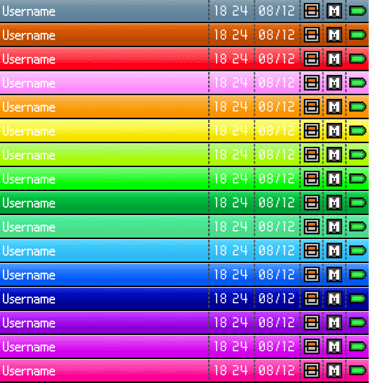

从左到右分别是：用户名、时间、日期、GBA 游戏模式、开机模式、电量。

---

表盘不需要那么多信息，只留下了用户名、日期、电量。

时间的话我觉得没必要加，**下面已经有更大的了**为啥还要看更小的呢（）

剩下的图标，我**一是**觉得没必要，**二是**加上了之后右半段的信息就太多了，有通知图标 / 后台应用图标的时候会被挡上。

于是就没加。

---

原版可以选择**喜欢的颜色**。

表盘没做这个系统，**一是**太麻烦，16 种颜色每个都要画一遍；**二是**跟计划做的数字 / 模拟时钟有点冲突，因为时钟的配色是根据喜欢的颜色（顶栏颜色）决定的。

~~咱不像格雷那样换个色调就是一个新矿物（）我没那实力和精力去做通用的底图~~

---

顶栏的颜色还有**仿色 / 抖动**的效果。

做的时候，在 PS 里画了中间的部分，然后在 Figma 里把图片填充类型改成**平铺**，就能在水平方向上**无限延伸**了。

顶上和底下的两条则是矩形。因为当时画的时候并不清楚这个“仿色的部分”竖直位置是怎样的，就搞了这种可以**灵活移动**的结构。

## 时钟
考虑到不少人肯定还是习惯数字时钟的，就设计了个数字时钟当做**可编辑组件**。

模拟时钟没什么好讲的，就是**照搬原作**；直接来看数字时钟：

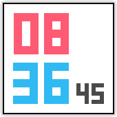

......不过也是平平无奇的设计。不过既然不是主打的时钟样式，**看起来说得过去**就行（）

::: details 奇妙的巧合？
时分针的红蓝配色居然能跟 Nintendo Switch 的**经典霓虹红蓝色**对应的上！

任天堂，这也在你的算计之中吗！（）
:::

### 小组件边框（编辑按钮）
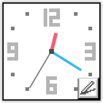

顶层图标照搬了 **PictoChat** 的设计，底层则是主屏幕下方设置的图标的底图。

~~什么缝合怪~~

::: details PictoChat
↙️ 左边栏的笔

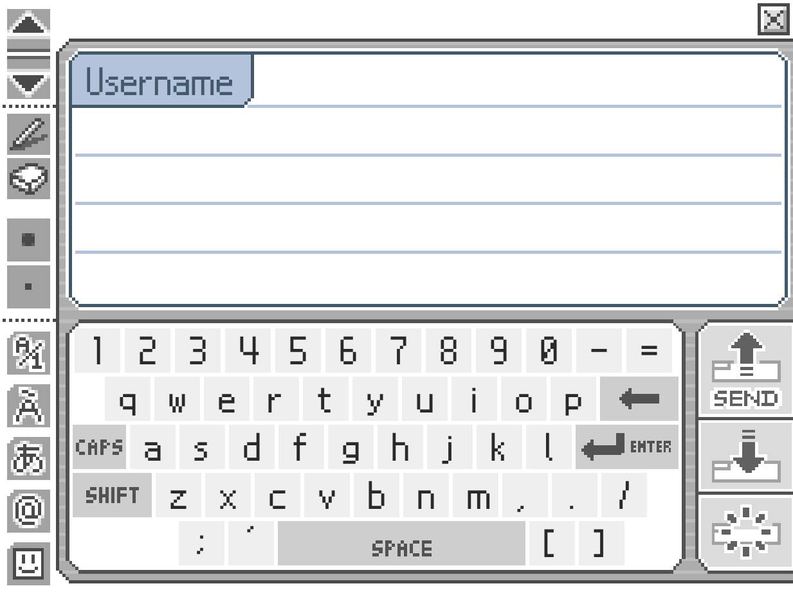

没想到居然能像素完美地塞进那个按钮底图里，

任天堂，这也在你的算计之中吗！（）（）（）
:::

## 日历
众所周知，不用 **Lua** 的话，是**做不到**原版的日历效果的。

::: details 原版日历是啥样的？
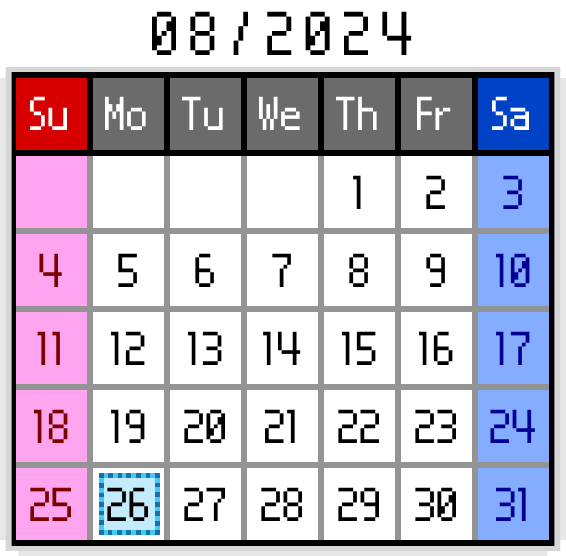

高亮今日。
:::

再加上手环并不像 NDS 那样**横向空间足够**，所以日历必须要**改版**。

时钟一定要是正方形的，那么给日历留出来的**就剩一条**了。这时想到了——

::: details 翻页式日历不就是长条形的吗？
我是说**去掉无效信息**之后的（）

:::

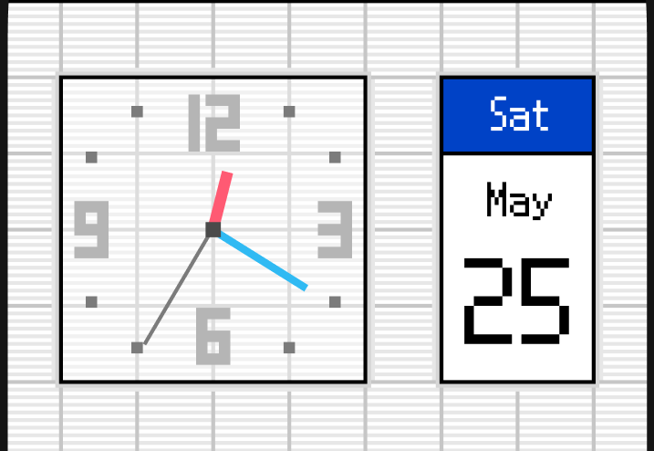

小字 20pt，大字 50pt，完美解决~

另外星期背景做了与原版**相同的处理**，周六是**蓝色**背景，周日是**红色**背景，其余为**灰色**。

## 烦人的网格系统

前文提到了社区那个设计稿并不能直接用，只好自己画了。

并没有在一开始就定下网格系统，而是**边验证边改**的。

::: details 第一版
先设计了上半部分。下半部分只是预览

看着还不错？

但是看久了之后才反应过来，这个边框足足有 **4px**！！

边框**喧宾夺主**了，真的是丑到没边了。。。。

---

这个时候也没意识到，边框**不一定**要跟网格的边缘**严格对齐**。

（没看明白的话，看后面的版本）

:::

::: details 第二版
开始着手下半部分的网格设计了：

然而设计完发现**天塌了**：下方的网格完全可以给上面用，完美解决了上方网格看起来**太密**的问题。。。

是的，要重画！！时钟、日历都要重做（哭）
:::

::: details 第三版
确定了最终的网格系统。不过时钟和日历还没有重画。

此外边框不会跟网格的边缘严格对齐了。（实际观感还是**不错的**）

:::

::: details 终稿

终于差不多了。。。

此外最下方一行网格还做了**延长**。

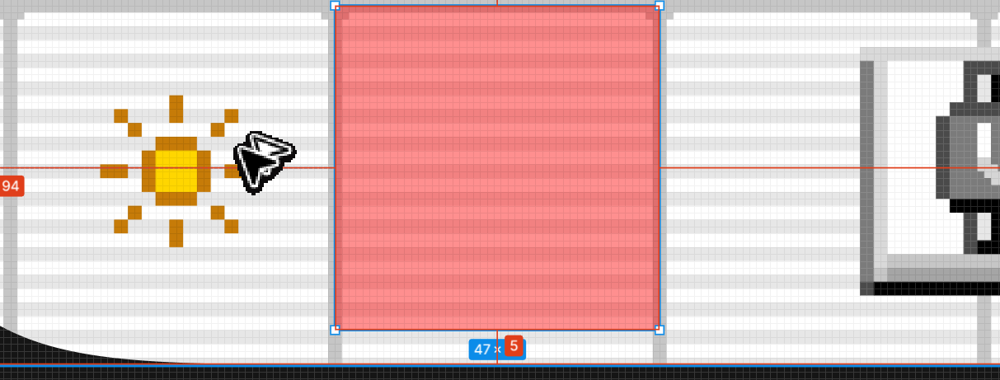

::: details 当时给朋友画的解释图
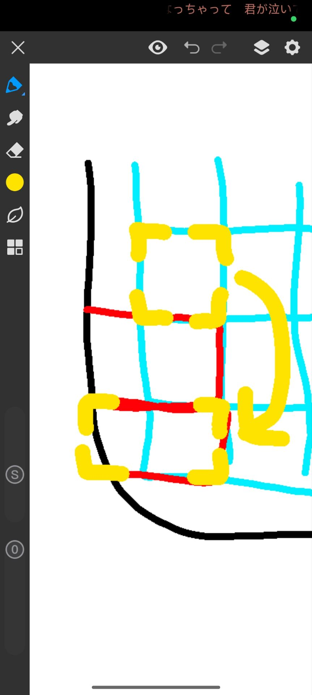
:::

最后网格看起来就比较完美了。而且大小网格还能**无缝衔接**，**细看也看不到接缝的程度**。

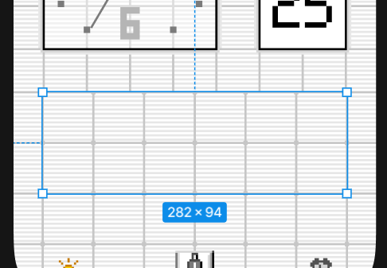

::: info 为什么没有像原版那样用更大的网格？
看起来**太怪了**，遂 pass 掉。

::: details 图
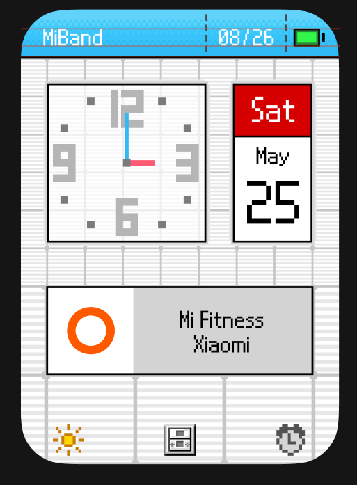
:::

## 卡带
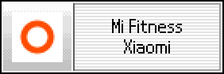

以这里为分界线，下方的网格比上面更大一些。原版也是这样的，所以做了这样的效果。

---

这里我想做点击跳转活力数据的效果，于是就想到了——

能看活力数据的应用，除了手环自带的还有个小米运动健康...

::: info 那就用运动健康好了~~
~~其实还是为了省事，一个⭕好画~~

另外目前没有表盘用过这样的创意（在表盘上以小米运动健康的 Logo 代指活力数据），这么设计也算是加了**一点点点创新**。
:::

---

图标则是**故意**让它变模糊的，为了模仿 NDS 时代模糊的游戏图标。

我先是画了个 64×64 的矢量图标，再以 32w（32px Width）导出，然后再粘贴上去的。

::: info 意外的巧合
表盘初稿的卡带图标大小是 64×64，缩小一倍**刚好**就是 NDS 游戏图标的大小（32×32）。
:::

## 底栏
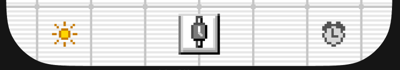

基本保留了原版的样式。

从左到右分别是：手电筒、设置、闹钟。

---

原版的小太阳对应的功能是屏幕背光调节。表盘里我有在想要不要把图标改成手电筒的样式，后来想想还是保留原样式吧。~~也有懒得画的因素在里面~~

原版的设置按钮是 NDS 的形状。说实话我不明白为啥要这么设计，不过还是照着它画了个手环。

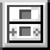

时针那里迫不得已用了**混素**，不用混素的话看起来实在是**过于抽象**了。

## AOD
这次的 AOD，最开始我是没什么想法的。

我的表盘的 AOD 里，一直喜欢让 AOD 的时间样式与位置与亮屏**保持一致**。然而这次我觉得这么搞不太彳亍， 时钟太小，熄屏之后看起来**不协调**。

于是只好让 AOD 不跟随亮屏样式了。

---

正想着怎么设计好，然后看到了 NDS 的闹钟功能：

::: details 长图 [点击展开]

:::

不错，那就这个主题吧（）

## 命名
最开始想延续 **DxxxxSxxxx** 的格式，让 AI 想了几个。

不过感觉都不太合适，就想了个 **dualSection**。

~~Section 这个词是英语书和 Figma 给的灵感~~

---

不过后来想了下，这表盘也并没有**严格两个分区**啊，叫这个还是**不太合适**，况且也**太长了**。

于是后来想到：Band 的结尾是 D，再加一个 S 不就凑出 DS 了嘛~~

那就这个了！

banDS 这样的名字也**简短多了**，**好记**。

::: info 首字母大写还是小写？
BanDS？banDS？

问了 DeepSeek 的意见，觉得还是小写有特点，那就小写了。

~~另外大写的话有种莫名的 BanG! Dream 既视感~~
:::

## 图标

把最有特点的几个元素拿了出来组合到了一起。

## 介绍图
::: details 总览

:::

主要布局直接**照搬**了前文提到的 Figma 的社区项目的封面。

::: details 图

:::

接下来一张一张介绍。

---

### 首图 / 封面 / 图 1

::: details 其实想搞一个 Logo 来着

但是**没啥经验**，搞出来的效果**也不是很好**，所以**放弃了**。
:::

> Y2K · 复古 · 像素风

这次加了标签，原因有二，一是跟[安龙](https://github.com/aurysian-yan)大佬的表盘《[跃界](https://astrobox.online/open?source=res&res=%E8%B7%83%E7%95%8C&provider=official)》学的，**快速突出特点**；

::: details 跃界的预览图

\*《跃界》是 安龙 Aurysian 的作品，此处仅为引用目的使用
:::

二是有人说设计像**山寨老年机**。为了避免类似于这样的**误解**，加了可能偏**中性** / **正面**一些的标签。

---

中文字体部分使用的是「[精品点阵体9×9](https://github.com/scott0107000/BoutiqueBitmap9x9)」。很久以前收藏的字体，但**从来没用过**，这次终于能**实践使用**了，看起来效果也**很不错**。

---

作者水印部分加了个表情😊，任豚估计**不会陌生** 😏

### 图 2

原先的“特点”页，这次给**拆散了**，因为信息量实在**太大**，一页**搁不下**😂

---

左侧的 OG NDS BIOS 其实裁掉了一点点空白的网格，让这个图片占的面积稍微小了些。

右上角的说明特意避开了 AstroBox 资源介绍里的翻页按钮。在标准显示大小的 Xiaomi 15 上显示没问题。

### 图 3

接下来是两个小特点介绍。

渐进模糊（渐变模糊）的效果属于是**一拍脑门**想出来的。当时寻思着**下面有点空**，那就**加个特效**吧~~

::: info 又有新的问题？
加了模糊会导致图片的**体积变大**。

不过它也不是头图，加载慢点就慢点吧，反正最先看到的不是他（）
:::

### 图 4

对话框使用了 NDS 的警告样式。

::: details 点我查看
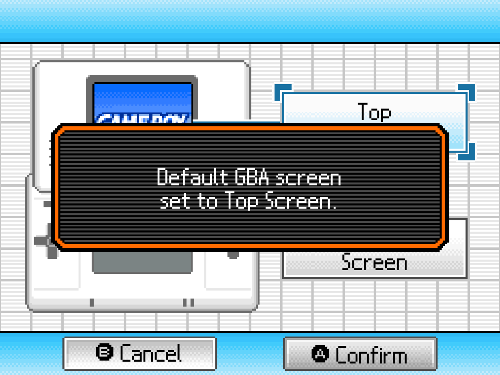
:::

不过这里并没有达到**像素完美**。~~我实在是搞不动了（（（~~

### 图 5

这次想来点跟以往相比不一样的。

然后就想到了 NDS 设置的**当前页面说明**。

::: info 顺便说下...
感觉这也是个**很天才的设计**。

随着进入设置层级的**深入**，这个提示也会**叠加多层**。

::: details 看起来是这样的
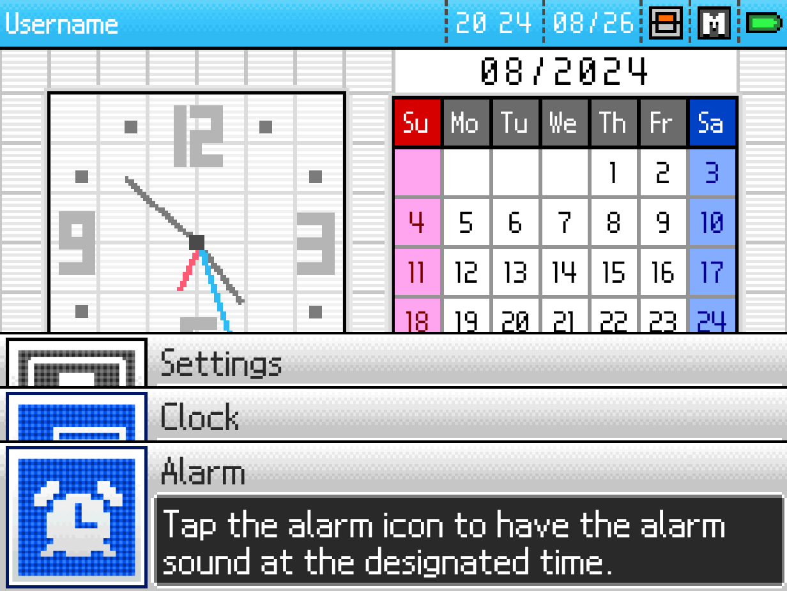
:::

上面的实机演示图则是觉得**上面太空**，就搞了个**大图**填充上。

使用了 [Zaona](https://github.com/Zaona) 大佬的生成器 [MiBand Proto Forge](https://miband.zaona.top/)，很好用👍

## 后日谈
待更新

## 你知道吗？
- 电池的图组的命名是“**电解液**”。
- 时钟最开始是用 PS 画的。当时觉得 Figma 画可能不太好用，结果**现实啪啪打脸啊**。。。

  ::: details 真香
  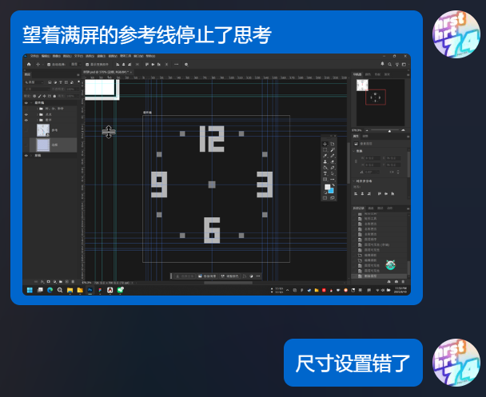

  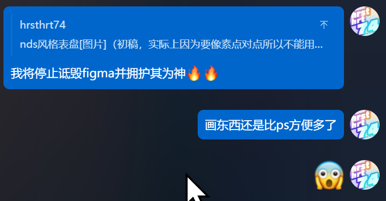
  :::

- 制作的时候在纸上写了很多东西，请看图：
  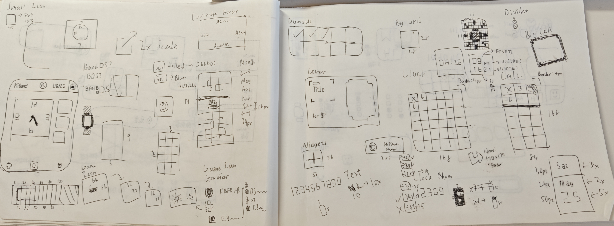

## 感谢你看到这里！
不妨去 AstroBox 下载体验一下😋

<WFDownloadBtn title="banDS" resourceName="banDS" />

## 评论

<Giscus />