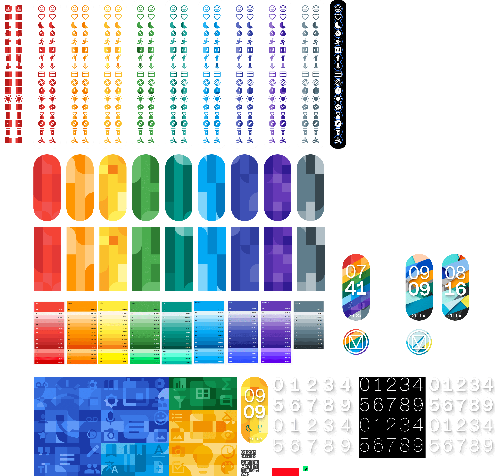
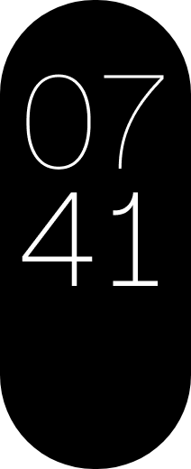

---
next:
  text: 'WF2'
  link: 'docs/creation/watchface/WF2'
---

# MaterialFlex & MaterialMania

##### 9th & 10th Watchface / 2025/9/5
致敬~~与复古~~。

* Material Design 1 已经是十多年前的设计了

<mark>至此，制作 10 个表盘，达成！！算是达成一个小目标~~</mark>

::: ai

*Powered by ChatGPT*

**MaterialFlex** 与 **MaterialMania** 是一组以 **Material Design 1** 为主题的双线设计，尝试重新呈现早期 Android 时代那种**色彩鲜明、层次分明、富有活力的大色块视觉风格**。

两款表盘采用同一套设计语言，但在定位与实现方式上有所区分：
**MaterialFlex** 为付费表盘，背景模仿 MD 时代 Play 商店应用头图，并支持多达 17 个快捷方式跳转，是功能与制作成本都较高的一款；
**MaterialMania** 为免费表盘，使用经典的 MD1 Android 默认壁纸，保留核心视觉风格但去除跳转功能，作为更轻量、更易体验的选择。

在视觉与排版上，表盘整体以**可读性**为优先：时间与日期统一使用白色，长投影采用**柔和边缘**处理，在**保留 MD1 气质**的同时让整体观感**更现代**。字体选用 MiHaus，通过**粗细变化**区分小时与分钟；日期信息则采用**简化格式**，以适配跑道屏设备有限的显示空间。
AOD 模式中使用**更细的实心数字**，在显示效果与防烧屏之间**取得平衡**。

在图标、背景与宣传图的设计上，整体刻意参考 Play Store **轮播式介绍图**的展示逻辑：每一页突出**一个重点**，通过**波浪式排列**、**长投影**与**斜切标题**等方式强化 MD 风格的**动感与层次**。
这组作品在**贴图数量**、**配色适配**与**工程整理**上投入了大量时间，是一次工作量显著高于以往的创作。

总体而言，这不仅是一次对 Material Design 早期风格的**致敬**，也是一次结合**设计**、**工程**与**定价**策略的实验性尝试。

:::

## 灵感

小时候，[Material Design 1](https://www.mdui.org/zh-cn/design/1/#color-color-tool) ，给我幼小的心灵带来了极大的震撼（）（）

原来 Android 的 UX 视觉可以不像 Holo* 那样**单调无趣**，而是可以**充满活力**。

::: details *Holo 的一个 Web 示例
Android 4.x 的主要设计语言。

<iframe src="https://holo.zmyaro.com/index.html" width=600 height=700 frameborder=0 scrolling=no loading=lazy ></iframe>

https://holo.zmyaro.com/index.html

:::

然而经过了十年的演变，现在的 MD3(E) 里很难再看到像 MD1 那样**色彩鲜明**的大色块设计了。

于是为了致敬 MD1，同时也是为了让自己练练手，就想到了以 MD1 为主题设计表盘。

---

而且感觉 Play 商店里 Google 给自家应用做的 MD 风的头图，真的很有设计感。

现在 Play 商店手机端取消了头图之后，这就真的成了**只能追寻的历史**了。

于是就决定在表盘上复刻一波！🤓

## 开工

*图片较大，可能需要一点时间加载

这次的工程，复杂程度跟之前的 [The Commander](/docs/creation/watchface/The_Commander.md) 不相上下啊~~ 工作量又到了一个新的高度。

---

从设计之初，就决定了是 MaterialFlex 和 MaterialMania 两个表盘**双线开发**。

这么做是因为，MaterialFlex 已经定好了是付费表盘。但考虑到很多人不愿意或无法付费，这就让表盘推广有一定门槛。

于是就想到了同时做实拍风的 MaterialMania，免费下载，~~借此涨一波流量~~。

下文介绍设计~

## 时间、日期

没有用彩色的，而是统一为白色，为了可读性。

**长投影**的效果，并没有使用 MD1 流行时常用的硬边缘，而是使用了软边缘。~~因为一个个套蒙版比较麻烦（））~~，不过也有为了看起来更现代一点点的原因。

用 Figma 的插件 [Beautiful Shadows](https://www.figma.com/community/plugin/1068595505353552645/beautiful-shadows) 做出了柔和投影的效果。

---

字体用的是 MiHaus*。至于为什么没有用 Roboto 呢，我是觉得 Roboto 的英数还是不够美观，尤其是跟米系的字体相比。

::: info 这个字体是？
HyperOS 3 新增的锁屏字体。因为制作这个表盘的时候刚好赶上 OS3 内测，觉得这个字体还挺好看的，就用了。

其实应该是第一个用这个字体的表盘，不过也没啥值得宣传的就是了~~

:::

字体上面细，**下面粗**，区分小时和分钟。

关于日期，因为是跑道屏的手环，不好放下太多信息。所以日期用了「06 Sun」这样的简化格式。

## 快捷方式跳转

MaterialFlex 里最复杂的部分，花了相当多的精力去搞贴图。

不过 MaterialMania 里没做，其实是为了⭕️💰（）所以免费版没做跳转。

这次做了多跳转适配，以前因为懒所以没做（）。共计 17 个跳转。

---

细看其实还能发现每张图都不一样，甚至左右两边都是不一样的，为了适配背景的彩条。

共计 323 张贴图。由于工具的限制，不同配色**不能自动替换**贴图，只能一张一张**手动替换**，相当之蛋疼。在这上面大概花了差不多一周的时间，都花在手动替换贴图上了orz

::: tip 题外话
在做跳转贴图的时候顺便学习了 Figma 的颜色样式怎么用，真的是帮大忙了，要不手动一个个替换颜色要累死了
:::

## 背景 / 壁纸

是 MaterialMania 和 MaterialFlex 最大的不同，同属一个设计语言（Material Design）但是是两个不同的方向。

### MaterialFlex

是如 [前文](#灵感) 所述的，仿 MD 时代的 Play 商店头图风格，按照它自己画了背景图。

### MaterialMania

这个则是用了 MD1 时代的 Android 默认壁纸。[原地址](https://www.studiokleiner.com/commission/google-paperscapes-color)，里面真的每一张都很好看，很经典。

## AOD

|                                                            |     |
|:---                                                        |:----|
||数字细了一些，是为了防烧屏。另外这其实是我第一个用**实心数字** AOD 的表盘（）。以前一直是为了防烧屏 ~~和偷懒~~ 用描边数字。|

## 命名

Material 很容易想到了，那 Flex 和 Mania 是怎么来的呢？

.........

*~~跟之前我的很多表盘一样，也是随便起的名字~~*

::: info 其实...
打算把 -Mania 做成一个系列。敬请期待 ～(∠·ω< )⌒★
:::

## 图标

|      |      |
|:----:|:----:|
|||

把 Material Design 的 Logo 和壁纸融合了起来。

Logo 下面还加了淡淡的阴影，提高了一下可读性。

## 介绍图

<mark>**Tips：可以左右滑动 / 拖动进度条~**</mark>

### MaterialFlex

  <table style="width: 2500px;">
      <tr style="border: 0">
        <td style="border: 0"></img></td>
        <td style="border: 0"></img></td>
        <td style="border: 0"></img></td>
        <td style="border: 0"></img></td>
        <td style="border: 0"></img></td>
        <td style="border: 0"></img></td>
        <td style="border: 0"></img></td>
        <td style="border: 0"></img></td>
      </tr>
  </table>

### MaterialMania

  <table style="width: 2200px;">
      <tr style="border: 0">
        <td style="border: 0"></img></td>
        <td style="border: 0"></img></td>
        <td style="border: 0"></img></td>
        <td style="border: 0"></img></td>
        <td style="border: 0"></img></td>
        <td style="border: 0"></img></td>
        <td style="border: 0"></img></td>
      </tr>
  </table>

两套宣传图是一个模板，一起介绍。

---

因为 Play Store 里的应用就是以轮播的介绍图的形式来展示应用的，所以模仿了这样的样式。

以前用 4:3 的介绍图的时候，可能一张图里要写 1~3 个特点，这次因为图片比较窄，每页就**只放一个特点**了。

---

表盘展示用了个**波浪形**的排列，感觉药丸型的表盘天然适合这么排列展示啊，尤其是样式一多起来（）

Logo 做了**长投影**的效果，毕竟是当年跟 MD1 一起火起来的设计风格，就用了它~

每一页的标题用了 [斜切](https://www.figma.com/community/plugin/1219749104610050886/skew)，只是为了看起来更有活力一些。毕竟 MD1 就是个充满活力的设计对吧~

其他元素也都做了对应 MD 样式的设计，**看图即可，不再赘述**~

::: info 唯一的问题
在 AstroBox 上的实际显示效果有点奇怪。第一页因为跟后面的比例不一样，会**凸出来一截**，我也懒得改了，差不多能看就行~~
:::

## 定价

因为工作量实在太大，超出了预期不少，所以这次定价就稍微高了一些，￥2.99。

也正因为本次**定价偏高**（对于我预估的大众对于这类设计的表盘来说），所以 [上文](#灵感) 也提到了，做了一个免费的表盘作为**补偿**。

::: info 小巧思这一块
只需要套一样的模板，不仅不多费精力，还能多一点下载量（虽然现在还不是很清楚 AstroBox 那边的下载量），更能给付费的表盘引流（）
:::

## 后日谈

表盘自定义那边的下载量有点少啊~不过销量倒是还可以，大概在 20 份左右，虽然从销量上来看是不如往期作品的，但是因为单价高所以收入也还可以。

因为这**也是**实验性质的表盘，能有这些用户认可，我觉得还可以~

如果有你的一份的话，非常感谢~~~

## 你知道吗？

- 这里的「完整版内容」其实是**手写的**。当时数位板刚到货，想试试于是就直接把写的字贴上去了。~~写得不好看~~

  

- 第一次在介绍图里**推销**表盘。不过做 MaterialMania 本来就是为了要**引流**嘛~

- 因为现在官方的 MD1 风介绍图已经下架了，所以为了找参考图费了老大劲了，终于是找到了九张 = =

- MD1 的动效设计规范视频非常滴好看，**动画很爽**，在此推荐给大家：[传送门](https://www.bilibili.com/video/BV1VV8bzAEQa/)

- 工期很足，于是工程里的图层名、页面名整理的都很**整齐**（）（）（。）

  |                                                            |     |
  |:---                                                        |:----|
  |||

  也是头一次意识到，Figma 在图层列表里可以用一个超长的矩形和破折号——来给图层分组。

- 顺手把 [爱发电](https://afdian.com/a/hrsthrt74) 的头图换掉了。看起来还蛮有活力的~~

  

- 这篇 blog 我鸽了一个学期才写出来。当时做完表盘已经觉得有点累了，所以在这之后 blog 就一直搁置着，直到期末周了 ~~没事干~~ 才想起来写

  (\*/ω＼\*)

## 感谢你看到这里！
不妨去 AstroBox 下载体验一下😋

<WFDownloadBtn title="MaterialFlex 体验版" resourceName="MaterialFlex 体验版" />
<WFDownloadBtn title="MaterialMania" resourceName="MaterialMania" />

觉得设计还不错的话，也可以考虑支持一下我~ 非常感谢~

[前往爱发电购买 MaterialFlex 完整版](https://afdian.com/item/3338d22c8a2811f0847a52540025c377)

## 评论

<Giscus />