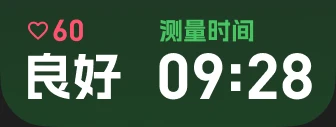

---
next:
  text: 'CAPTURE THE MOMENT'
  link: 'docs/creation/watchface/CAPTURE_THE_MOMENT'
---

# 死了么

##### 12th Watchface / 2026/1/15

`STILL ALIVE`

实验性设计，也是目前制作<mark>**最快的一次**</mark>，从创意到落地发布一共就几个小时🤓

::: ai
这篇文章介绍了作者制作的一款实验性表盘 **《死了么》**。该作品从创意到发布仅用了几个小时，是作者目前制作速度最快的一次。名字主要是为了**蹭当时热门的同名应用热度**，带有玩梗性质。

### 设计思路

* 整体布局模仿 **快应用界面**，而不是传统表盘，因此视觉上更像一个应用。
* **顶部**采用类似快应用 Header 的结构，把原本时间的位置换成了 **日期**，因为时间放在那里会太小不易查看。
* **中间部分**是类似“心电图”的动态图形，共做了 **5个档位**，主要用于视觉效果，实际上绑定的是 **压力数据** 而不是心率。
* **背景**使用类似 Apple Watch 的 **深色渐变**，让界面更像应用，避免纯色背景的单调。

### 信息布局

* 底部采用 **两栏并列结构**：

  * 第一栏：显示 **心率数字 + 压力文本**
  * 第二栏：显示 **时间**，标题写成「测量时间」，强化“应用数据”的感觉。
* 数字字体使用 **DIN**。

### 图标与宣传

* 只制作了一张宣传图，因为这是实验性项目。
* Logo 用 **竖排大字**，并特意标注这是“表盘”而不是快应用。
* 还加了免责声明，提醒该表盘 **仅供娱乐，不具备医疗诊断作用**。

---

**一句话概括：**
这是一个借热门应用梗制作的实验性智能手表表盘，设计上刻意模仿快应用界面，通过压力数据模拟“心电图”，整体更偏向趣味和视觉创意，而非严肃功能。 😄

:::

## 设计

其实叫「**死了么**」这个名字，只是为了蹭热度。

当时刚好有个就叫「**死了么**」的 APP 很火，于是做了。

---

设计上应该一目了然了，很直观。

本次整体布局，是按照**快应用**的思路去做的，而不是**表盘**。

因为原作「死了么」就是个**应用**，刚好本次想尝试一些跟普通表盘**不一样**的设计，于是就这么做了。

上半是标准的米米的快应用 Header 布局，只是时间位置换成了**日期**。毕竟还是个表盘，这里放时间的话太小了，**看不清～**

中间的「**心电图**」，做了 5 档。其实是为了好看而已，并没有完全按照官方的来分（4 档）。

（其实第 5 档算是纯整活的。平时根本达不到这一档～）

说是「**心电图**」，但其实绑定的数据是**压力**，不是**心率**，因为我觉得心率不能直接对应「死了么」的状态。

背景则是做了个跟 Apple Watch 同款的**深色渐变背景**，为了更有「应用」的感觉。

::: info 如果不加渐变的话…

看起来很单调啊🤨
:::

::: info 其实这个线…
还是数位板画出来的。|･ω･｀)
:::

---

底部信息用了「**小标题 + 内容**」的两格且**并列**的排版。

**第一格**是心率和压力文本。我觉得既然有地方，那就顺便放一个**心率的数字**在这作为副信息显示吧，反正也跟健康状态有关～

**第二格**则是时间。有意思的是，小标题我写的是「**测量时间**」。

我想让它有应用内的数据的感觉，又要让用户觉得这还是个表盘。所以加了「**测量**」两字。

数字字体则是 **DIN**。那段时间很喜欢它，所以用了（）

## 图标 & 宣传图

是的，本次就做了**一张**宣传图。因为是实验性表盘嘛，不想投入太多精力，于是摸了～

<mark>（但是我忘了把注意事项和QQ群组写上了😭引流失败）</mark>

标题 Logo 左上角特意强调了一下，这是**表盘**不是**快应用**。

因为跟快应用做的实在是太像了，所以得区分一下～

至于为什么 Logo 用**竖排大字**，说实话我也不知道…………就是脑子里突然蹦出来的设计啦 qwq

底下按照官方在应用内的**声明**，也写了个「
\*本表盘仅供娱乐，不构成诊断治疗依据，如有不适请及时就医
」。我怕真的有人拿这个表盘去检测身体健康😱

## 后日谈

人气居然要比预想中要高一些诶🤨看来蹭这一波热度还是有效果的

还有人说能不能做其他设备，只能说，实验性的表盘，这死了么的热度过去之后就凉了，做这个费力不讨好。over

## 感谢你看到这里！
不妨去 AstroBox 下载体验一下😋

<WFDownloadBtn title="死了么" resourceName="死了么" />

## 评论

<Giscus />