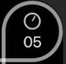
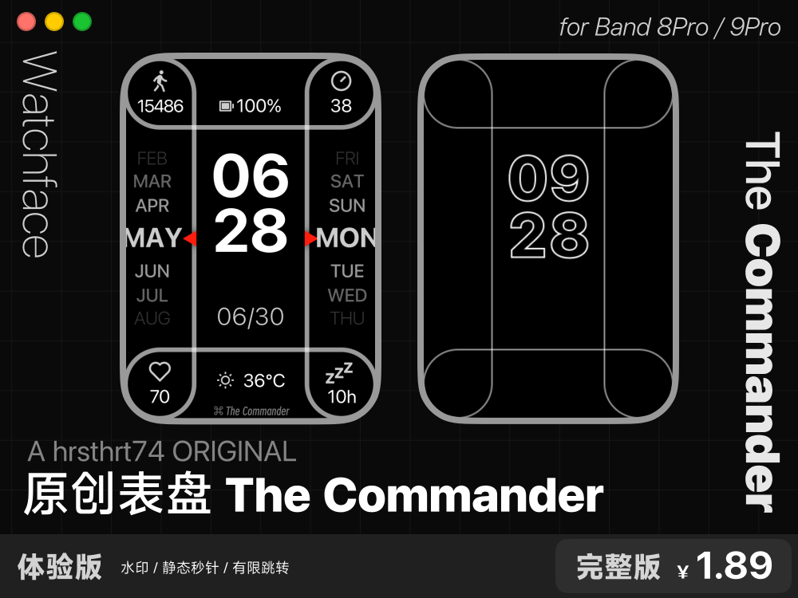
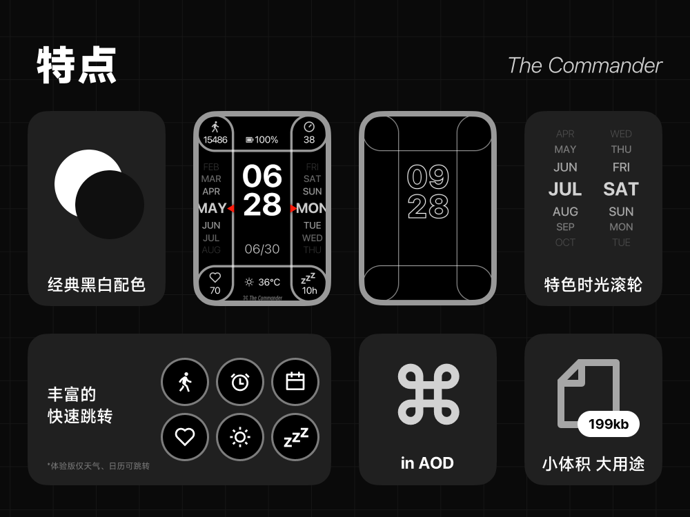
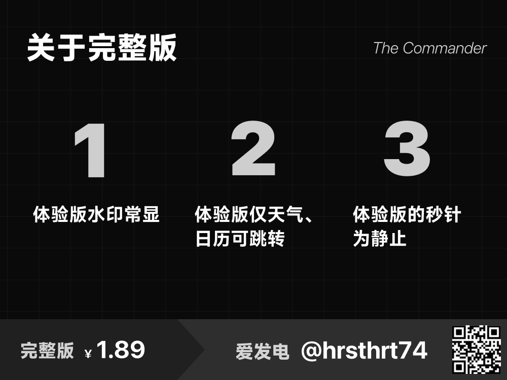
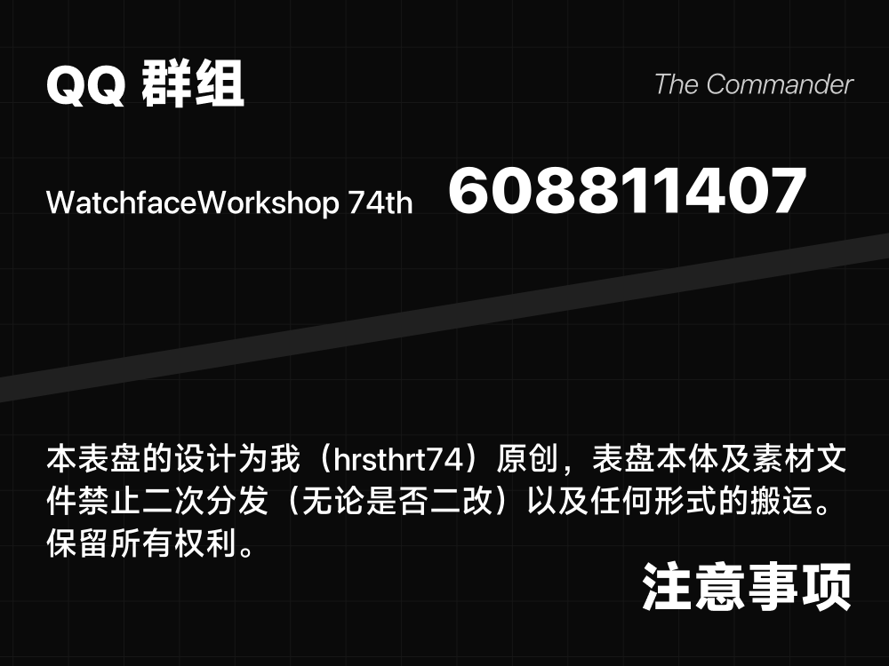
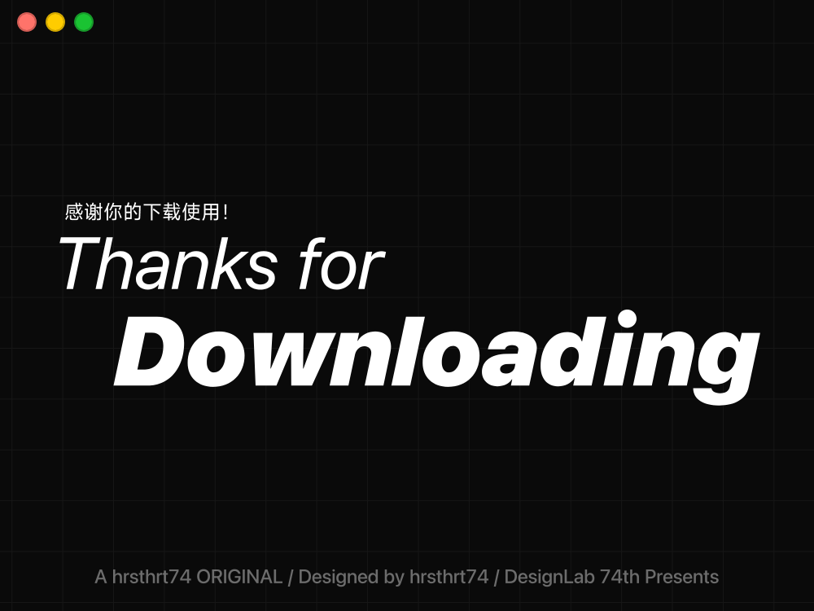

---
prev:
  text: 'PoP☆P'
  link: 'docs/design/watchface/Pop_star_P'
---

# The Commander

###### 2025/7/6
我的第一款原创表盘，也是第一款付费的表盘。

::: details DeepSeek 总结

**「The Commander」表盘诞生记**  
作为首款原创付费表盘，设计灵感源于 Apple Watch 的角落按钮布局与 Mac 的 ⌘ 键符号，巧妙适配小米手环 9 Pro 的方形屏幕。核心亮点包括：  
1. **极简美学**：黑白主色调搭配 80%-50% 灰阶透明度，层次分明；红色三角指针（灵感来自米家台灯电线）点亮视觉焦点。  
2. **创新交互**：  
   - 四角运动健康数据 + 独创「时光滚轮」设计（受 Pixel Watch 同心圆表盘启发）  
   - 动态秒针图标彩蛋，打破静态沉闷感。  
3. **技术攻坚**：优化睡眠数据显示，弃用进度条/渐变等设计（自嘲因"懒"妥协）。  
4. **定价策略**：锚定矿泉水日常消费，定价 1.89 元平衡收益与用户心理。  
5. **宣发匠心**：  
   - 网格秩序感海报融合 macOS 红绿灯元素  
   - 竖版 PV 采用真实键盘音效（厕所录制）与电子乐，强化 Command 键主题。  

**创作反思**：  
- 原创设计拒绝未授权素材盈利  
- 简洁风面临小众挑战，坦然接受"有手就行"等争议评价  
- 埋藏手绘睡眠图标、暗水印等细节彩蛋  

> "不可能让所有人喜欢，但坚持设计本心。"  
**支持通道**：[爱发电传送门](https://afdian.com/a/hrsthrt74)  

---

总结浓缩了设计历程的核心故事线，突出创意亮点、技术挑战与创作者思考，保留标志性细节（如红色指针、动态秒针），并强化了首款付费作品的里程碑意义。
:::

## 灵感
。。。来自某天的上课摸鱼。

虽然快高考了但还是紧张不起来，反而灵感<u>大发</u>（？）

但也能注意到，最初版跟最终版的设计有**较大出入**，这个后面再说。

---

我在想，既然 Apple Watch 在它们的更新里把动作按钮放到了屏幕的四个角落，那么**是不是也可以以此为灵感做一个表盘？**

嗯。。。**Command 键的形状 ⌘ 不就正好可以完美契合小米手环 9 Pro 的大方屏嘛**——于是画了。

---

从一开始就决定了，元素要**尽可能地贴边**，尽量展现小米手环 9 Pro 的窄黑边。~~（虽然发售这么长时间了这已经没有太多必要了~~）~~

四个角~~按行业惯例~~是运动健康数据。

左右两侧进行了小小的创新，设计了一个名为“**时光滚轮**”的数据展示方式。这里的灵感其实是来自于 Google 的 Pixel Watch 的那个很“出圈”的“**同心圆**”**表盘**。

::: details “同心圆”预览图

引用自[Ahla Home](https://zh-tw.a7la-home.com/how-to-get-pixel-watch-faces-on-galaxy-watch/)。
:::

同时当日/月的三角形指针特意设计成了**红色**，给黑白的表盘增添了一丝活力。（其实是从眼前的米家台灯的橙色电线来的灵感）

::: details 米家台灯 预览图

引用自小米商城。
:::

功能区提示文字（WEATHER、DATE）最终去掉了。理由是**加上后显得太过繁杂**。

底部的“The Commander”文字则是为了**让底部看起来没那么空**而设计的。当时也第一次看到表盘上带品牌 Logo 的设计，就感觉可以抄一下，正好填补一下下部的空白。

::: details 为什么叫 The Commander？
从 ⌘ 来的灵感，名字当然要跟 Command 有关系辣~~然后瞎想就想到这个名字了
:::

## 开工
不过因为**还要高考**，所以开工都是一个多月之后的事了。

做设计稿的时候，我其实**完全没有**参考上面的图片，而是凭感觉来画。。。这就导致了跟最初版的出入。不过后面想了想，时间如果横向放置的话会导致过小，进而导致易读性不佳，所以没采用这版方案也是情理之中。

**第一次做这么大的工程，学到不少，也很累。**（因为跟以往的作品比工作量大了很多）

对于喜欢简洁 ~~懒~~ 的我来说，这确实是个不小的挑战。。。

好在这次改用了[即时设计](https://js.design/)（以前是纯 PS），很方便，做到了**事半功倍**。比如好用的网格系统，自带的平滑圆角，随时可以操作的导出按钮，等等等等

---

从最初版可以看到，本来是要做进度条的，不过最终版没有。这个**纯属是因为我懒**（）下次做表盘再说。

配色也是我懒。本来是打算线条做渐变色的，但因为懒就不了了之了。

::: details 即使是黑白也不简单
**有经过精心的调整**。不能全是 #FFFFFF，那**数据的主次之分就一点都不剩了**。

优先保证时间的**可读性**，毕竟它是**表盘**。次一级的日期上了个 80% 的不透明度。四角的数字因为离时间比较远且面积较小，也用了 #FFFFFF，图标则是 80% 的白。底部的表盘名则优先级最低，用的是 50% 白。
:::

## 把它们组装起来
最开始用的是[钟艺之刻](https://ccwatch.cn/design)。但~~中医止咳~~ 钟艺之刻还是不够强大，睡眠数据无法补零，导致观感很差。好在后面通过某些方法解决了。

---

做的时候，我看秒数的图标，突然想到——**能不能让他真的转起来**？

.....算是一个小彩蛋吧。😂

按照设计，秒数需要一个图标来表示。但不动的秒针**太死板**，于是就加上了这个小细节。

---

由于编译器的限制，组件的坐标**不能为负值**。所以“时光滚轮”的设计其实是跟设计稿有少许出入的，**并没有严格贴边**。设计稿里的[出血](https://zh.wikipedia.org/wiki/%E5%87%BA%E8%A1%80_(%E5%8D%B0%E5%88%B7))留得太多了~~我下次注意orz

## 海报
::: details 横版

:::
简简单单的设计。

因为是黑白配色，为了让背景不太单调，**做了网格的效果**，也能体现出一种秩序感。

因为是以 macOS 的元素为灵感设计的，所以左上角加入了 **macOS 的红绿灯**，让配色没那么单调。

底栏是这次我个人比较喜欢的一个设计。**明确地体现出了这是一款付费的资源及其完整版定价**。底栏左侧也明确地标注出了体验版与完整版的区别，信息展示得**比较透明**了。

---
::: details 前瞻海报

:::
还做了预热的海报。当时**大多数的制作工作已经完成**，可以预热了。考虑到我自己本身人气也不高，就选择了**只预热 24 小时不到**，然后就发布了。

设计上也是简简单单。只给了本作的主题 ⌘ 这一个线索。

## 视频
<iframe src="//player.bilibili.com/player.html?isOutside=true&aid=114803804740089&bvid=BV1VrGFzBERP&cid=30876107978&p=1" scrolling="no" border="0" frameborder="no" framespacing="0" allowfullscreen="true"></iframe>

这次的表盘因为是第一个原创，对我来说还是有**里程碑式的意义**的，于是打算用心搞一搞宣发。

除了平时会做的海报之外，这次还特意做了 **PV**。

---

比例从一开始就决定**是竖屏的 9:16**。要考虑到用户观看的场景，绝大多数人都是**在手机上**了解表盘相关的信息的，于是就选了手机短视频最常用的**竖屏画幅**。

虽然也有本身信息就不多的原因啦（笑）

---

片头为了体现出 Command 键的元素，做了一个**粘贴效果**和**逐字键入**的效果，模拟文字编辑场景，**引入主题**。

::: details 为了看上去更加真实...
让 Command 键和 V 键的按键提示消失的时间**错开了几帧**。毕竟一般也不会**完美地**同时松开这两个键吧~~
:::

::: details 为了听上去更加真实...
**在厕所**录制了敲键盘的声音。真的有在按 h r s t h r t 7 4 的每一个键，**不是瞎打的哦** 🌚
:::

---

音乐用的是[这个](https://pixabay.com/music/future-bass-showreel-music-promo-advertising-opener-vlog-background-intro-theme-261601/) royalty free music。带些**电子乐**的元素，这个就属于是我个人的喜好了。直接截取了高潮的部分

---

剩余的部分就没什么可说的了。都是非常非常基础的设计。动画的话没太认真做，说得过去就可以了。

::: details 但痛苦的是...
**图省事没用 AE**。结果并没有省事多少。
:::

## AstroBox 宣传海报
为了上架 AstroBox 还做了海报。

::: details 海报

:::

其中「特点」这一部分仿的是苹果近几年使用的产品特性 lineup 的展示方式——网格。

::: details 参考

:::

不少设计都是一拍脑门子想出来的（x）。

当时没想到 AstroBox 能做到点击作者链接跳转到爱发电，就在图里放了个二维码，方便截屏之后识别跳转。也留了 ID，可以搜 ID 跳转到爱发电。

## 后日谈
做表盘，也还需要点**自知之明**的（？）。据我观察，更受大家喜欢的，还是**带立绘的**，**二次元的**表盘。简洁风想做到受欢迎还是太难了。既然选择了简洁风格，那就必须要接受可能没人气这个事实。

虽然心里默念“**不可能所有人都喜欢的**”这样的话，但看到吐槽的声音也难免会感觉**不太舒服**。
::: details 吐槽
- 欣赏不来
- 精品文案，表盘一般
- 666就这还赚钱啊
- 有手就行啊，除非把模版开源能自己改背景，不然真的没啥好买的

我去查了。如果我没猜错人的话，那这位大佬确实是有实力的。但付费资源，不会开源。既然您觉得有手就行的话可以自己复刻

- 我建议你要不把字体换换，这个说实话技术含量不高的，把字体换成镂空还会有怨种来搞搞

设计如此，不会改。镂空的话视觉上过于繁杂了。
:::

确实是有有意义的建议的。不过还是之后的作品再改吧，这次不想再改了。

心里接着默念“听不得批评建议就别发布表盘”吧还是~~~

## 你知道吗？
- 右下角的睡眠图标（zzz）其实是**手搓的**。
- 表盘文件里藏了两处**暗水印**。~~你能把他们全部找到吗？）））~~
- 表盘没有黑色背景图片，直接用了**系统默认的黑色画布**，减少了一些没必要的体积。
- 由于设计原因，**只适配了 9P 和 8P**。RW5 虽然也是方屏，但是竖向上给时间留的空间太小了，看上去太挤，因此没做。圆表的话，四周空间过大，强行适配的话看起来太怪了。跑道屏就不用说了吧，时光滚轮都没了，特色都丢了还做啥了😂

## 感谢你看到这里！
如果你觉得这设计过程也是不容易的话，不如考虑支持一下我🌚

\>\> 爱发电 [传送门](https://afdian.com/a/hrsthrt74)